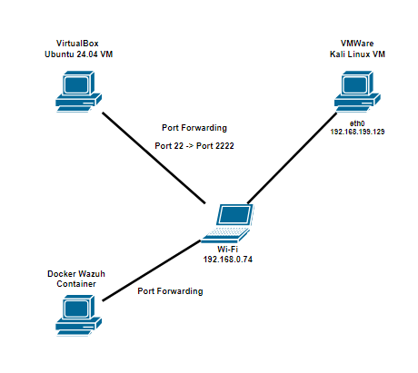

## Project Overview and Infrastructure
This project simulates a SSH Brute Force Attack on a server and the detection of such an attack by Wazuh. Additionally, it demonstrates how to protect the server from these attacks using Wazuh. To protect the attack, we will use active response module from Wazuh with firewall drop script.

Here are the infrastructures I used to simulate the intended environment:
<table>
  <thead>
    <tr>
      <th>Endpoint</th>
      <th>Description</th>
    </tr>
  </thead>
  <tbody>
    <tr>
      <td>Kali Linux in VMWare VM</td>
      <td>This is the attacker endpoint that performs the SSH brute force attack</td>
    </tr>
    <tr>
      <td>Ubuntu 24.04 in VirtualBox VM</td>
      <td>This is the victim endpoint that will receive the SSH brute force attack</td>
    </tr>
    <tr>
      <td>Windows 10</td>
      <td>This is the host machine that holds the virtual machines</td>
    </tr>
    <tr>
      <td>Docker Container</td>
      <td>This is where Wazuh operates (I am using Docker because it is lightweight)</td>
    </tr>
  </tbody>
</table>

The image below shows the network diagram of the environment. 

The attack will start from the attacker's IP address (<strong>192.168.199.129</strong>) targeting the host machine's port 2222. The host machine's IP address (<strong>192.168.0.74</strong>) will act as the intermediary for the attack on the server because I am using port forwarding from the server's port 22 to port 2222. Port forwarding is used because the attacker and victim machines are on different virtual machine software.

The Wazuh Dashboard can also be accessed from the host machine's IP address.

