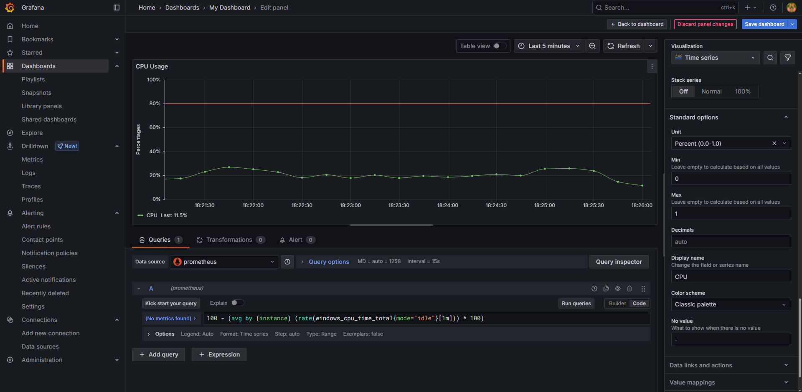

## Project Overview
This guide provides a step-by-step walkthrough for building a Grafana dashboard to monitor Active Directory metrics.

## Documentation
### Pre-Requisites:  
- Windows Active Directory Domain Services (AD DS) Server with Prometheus Windows Exporter installed  
- Prometheus Server configured  
- Grafana Server installed and accessible  
  
### Setting Up Prometheus Data Source
1. Log in to the Grafana web interface, navigate to the **Dashboards**, and then select **Create dashboard**.    
   
2. Click **Add visualization**.  
   
3. Select **prometheus** as the data source.  
   
4. In this step, I will display the CPU usage percentage over time. To do this, I use a PromQL query with the `windows_cpu_time_total` metric.
   ```
   100 - (avg by (instance) (rate(windows_cpu_time_total{mode="idle"}[1m])) * 100)
   ```
   The query calculates the average CPU idle time rate over a 1-minute interval, multiplies it by 100 to get a percentage, and then subtracts that from 100 to obtain the actual CPU usage.  
   Next, I adjust the visualization settings using the panel options on the right:  
   - Legend:  
     Values: **Last**  
   - Axis:  
     Label: **Percentages**  
   - Standard options:
     Unit: **Percent (0.0-1.0)**  
     Min: **0**  
     Max: **1**  
     Display name: **CPU**  
   - Threshold:  
     Add 80% threshold with red line.
   Save the dashboard to apply the changes.  
   
5. The result of visualization will appear on the newly created dashboard.  
     

     
