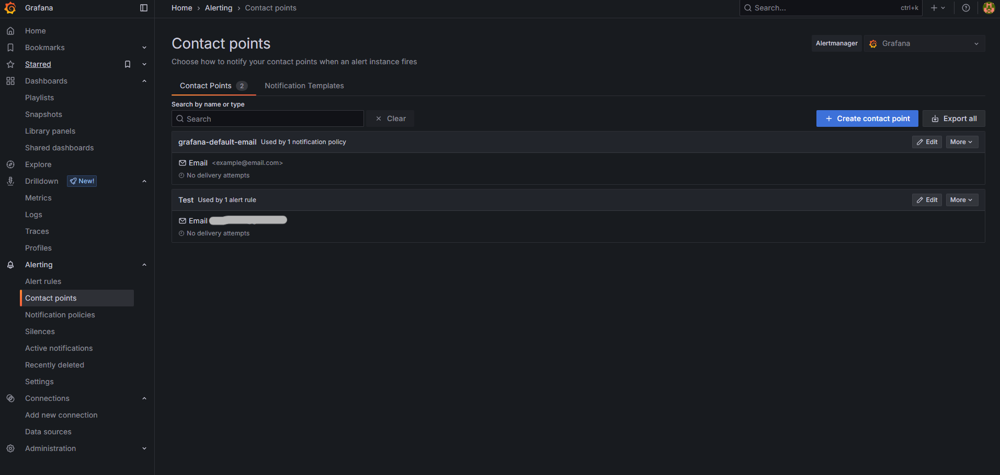
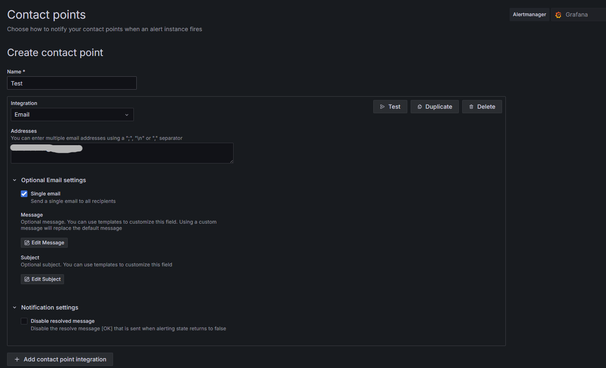
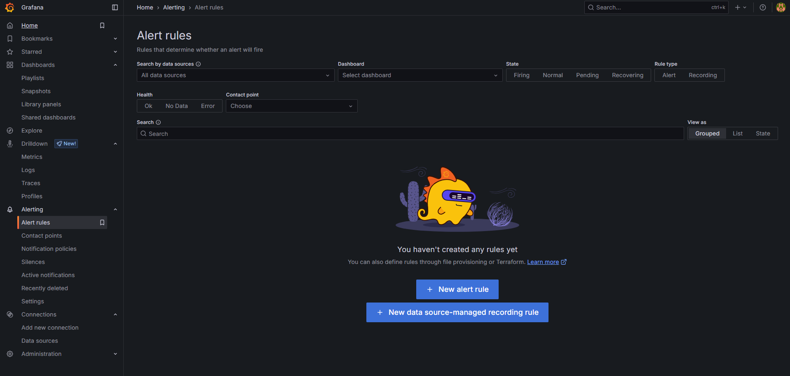
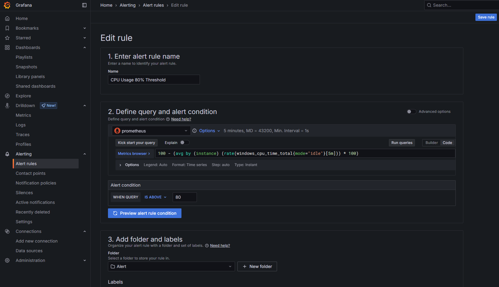
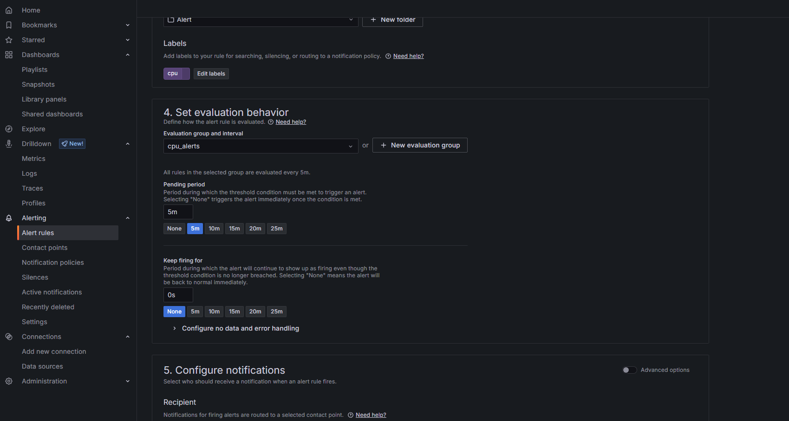
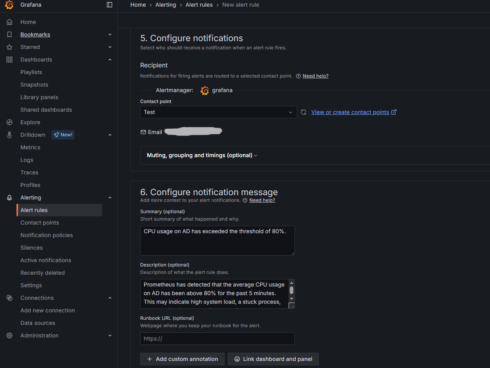
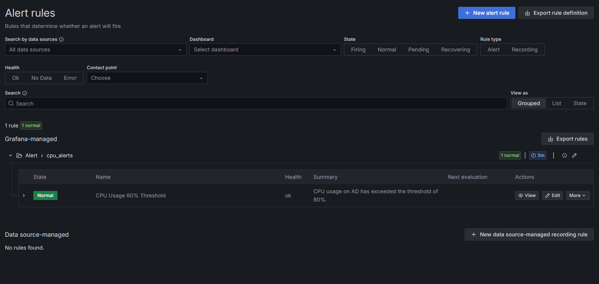

## Project Overview
This guide provides a step-by-step walkthrough for setting up alerting in Grafana to notify Active Directory (AD) issues. The alerts are configured to trigger email notifications through a predefined contact point, ensuring timely awareness and response.  

## Documentation  
### Pre-Requisites:  
- Windows Active Directory Domain Services (AD DS) Server with Prometheus Windows Exporter installed  
- Prometheus Server configured  
- Grafana Server installed and accessible  
  
### Setting Up Alert
1. Log in to the Grafana web interface, navigate to the **Contact points** option under the **Alerting** section in the left side menu and click **Create contact point** button.  
     
2. Provide a name, add recipient email addresses, and tick **Single email** if you want all recipients to receive one combined email. Then, save the contact point.  
   > **_NOTE:_** Emails will not be sent unless SMTP is configured in Grafana.
   > You can configure this in the **conf** folder. In my case, the configuration file is named **defaults.ini**.  
   > Follow the steps provided in the [Grafana official documentation](https://grafana.com/docs/grafana/latest/alerting/configure-notifications/manage-contact-points/integrations/configure-email/).

     
3. Navigate to the **Alert rules** option under the **Alerting** section in the left side menu and click the **New alert rule** button.  
     
4. I used the same query as in the dashboard but applied it over a 5-minute window. The alert condition is triggered when the query result exceed **80** , which aligns with our goal of detecting CPU usage above the 80% threshold. Also, create a folder for the alert and assign appropriate labels.  
     
   Next, configure the evaluation group to make the alert easier to find, and set the evaluation time window.  
     
   Select the contact point you previously configured. You can also add a summary and description to customize the notification message. Finally, save the alert rule.  
     
5. The result of the configuration is shown in the image below.  
     
