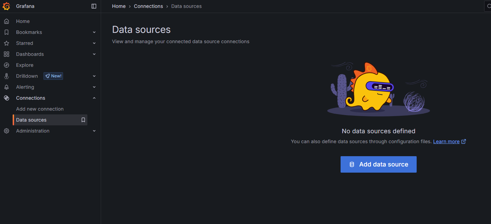
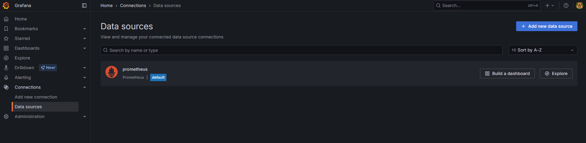
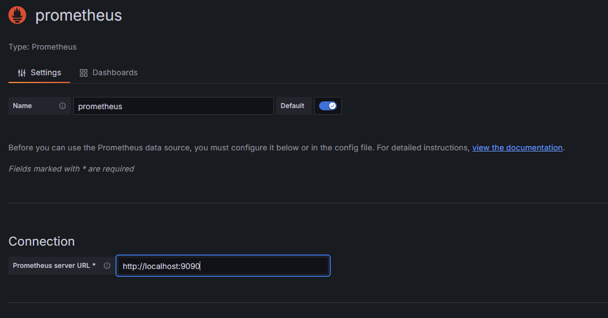
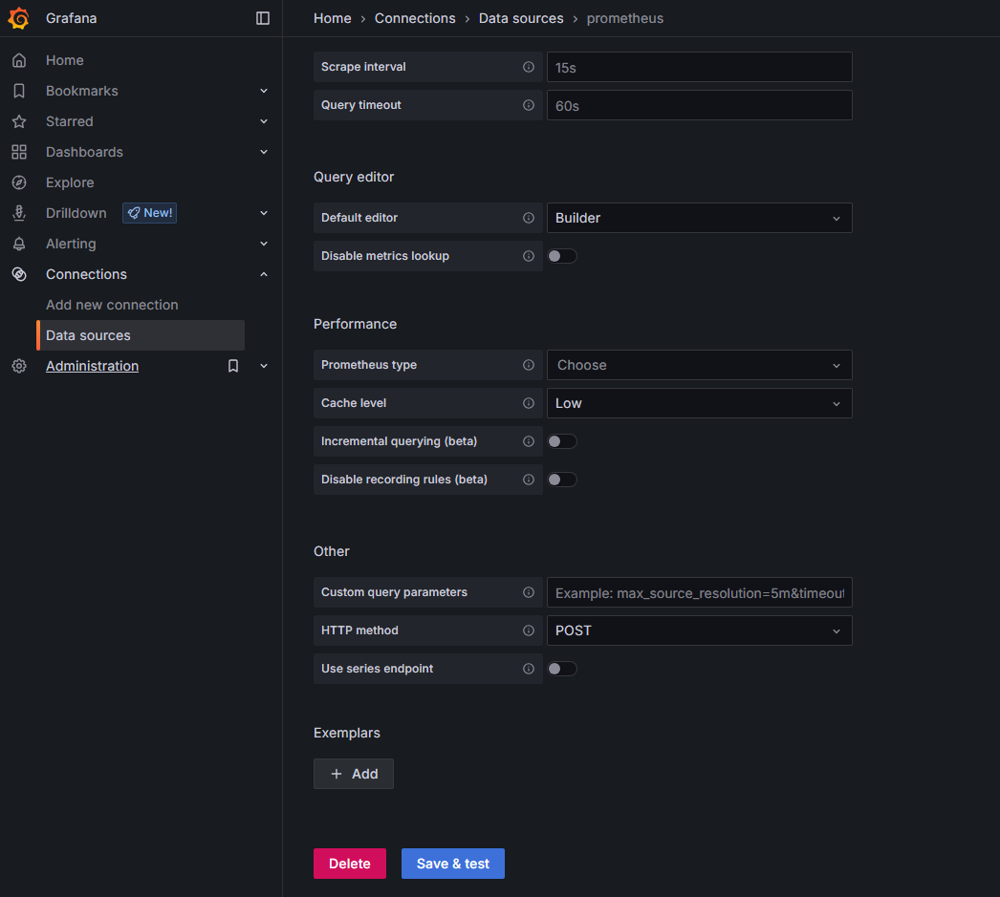

## Project Overview
This guide provides a step-by-step walkthrough for integrating Grafana with Prometheus and Windows Exporter (formerly WMI Exporter). By setting Prometheus as a data source in Grafana, users can visualize key metrics related to system performance, authentication activities, and Active Directory health.

## Documentation
### Pre-Requisites:  
- Windows Active Directory Domain Services (AD DS) Server with Prometheus Windows Exporter installed  
- Prometheus Server configured  
- Grafana Server installed and accessible
  
### Setting Up Prometheus Data Source
1. Log in to the Grafana web interface, navigate to the Data sources option under the Connections section in the left side menu and click the **Add data source** button.  
     
2. Choose prometheus as the data source.  
     
3. Set the Prometheus server URL to match the address of your Prometheus server.  
     
4. Click **Save & test** below the server URL configuration.  
     
