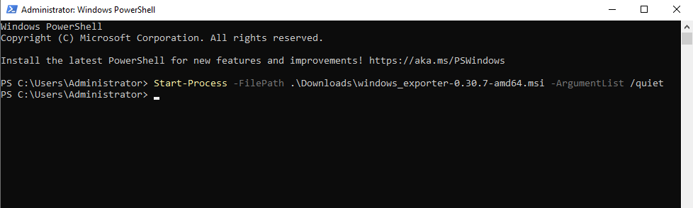
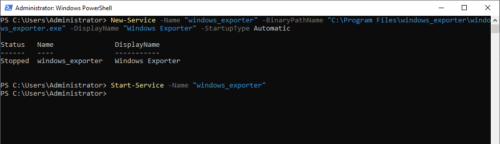
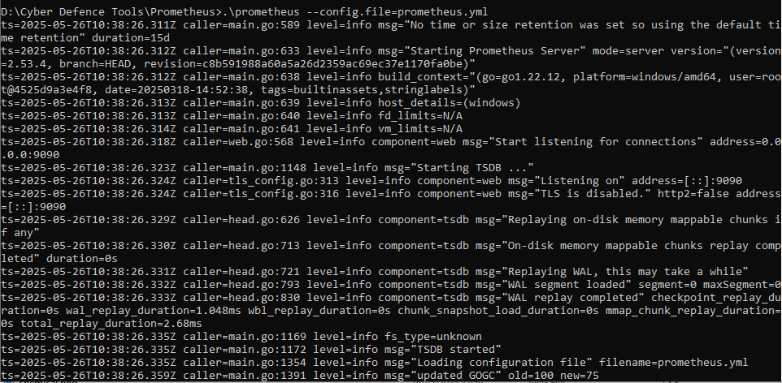

## Project Overview
This is a step-by-step guide for setting up a real-time monitoring solution for Active Directory environments using Grafana, Prometheus, and Windows Exporter (formerly WMI Exporter). This project enables IT and security teams to visualize system performance, detect authentication anomalies, and track Active Directory service health metrics, helping to ensure optimal performance and faster incident response.

## Documentation
### Pre-Requisites:  
- Windows Active Directory Domain Services (AD DS) Server  

### Prometheus Windows Exporter Installation
The Prometheus Windows Exporter will be installed on the Windows Active Directory Domain Services (AD DS) server. Ensure that the AD DS server is properly set up and running before proceeding.  
To download Prometheus Windows Exporter, first access the Prometheus community github and head to the releases page <br />
You can click on this url to get into the [installation page](https://github.com/prometheus-community/windows_exporter/releases)  
Then, follow these steps to install and deploy Windows Exporter:
1. Download Windows Exporter that is compatible with your server.  
     
2. Install the Windows Exporter by executing the following command in PowerShell on the Windows AD DS server.  
   ```powershell
   Start-Process -FilePath .\windows_exporter-<version>-amd64.msi -ArgumentList /quiet
   ```  
   
3. Configure the exporter to run as a service for easier and automatic startup.  
   ```powershell
   New-Service -Name "windows_exporter" -BinaryPathName "C:\Program Files\windows_exporter\windows_exporter.exe" -DisplayName "Windows Exporter" -StartupType Automatic  
   Start-Service -Name "windows_exporter"
   ```  
   

### Prometheus Installation
1. Download Prometheus from the official website [here](https://prometheus.io/download/)  
2. Extract all the files, then open `prometheus.yml`. To scrape metrics from the Windows Exporter, add a new job named "windows_exporter" with the target set to the IP address of your Windows AD DS Server and port `9182`.  
   
3. Run Prometheus from within the Prometheus folder using the following command:  
   ```
   .\prometheus --config.file=prometheus.yml
   ```
     
4.  Verify the configuration by navigating to `localhost:9090/targets`in your browser. Ensure that the `windows_exporter` target is listed and marked as "UP".  
     
  
### Grafana Installation
1. Head to the [Grafana Download page](https://grafana.com/grafana/download?platform=windows) to get the latest Windows installer.  
2. After downloading the Grafana installer, run it and follow the instructions to complete the installation.
3. Go to the Grafana page at `http://localhost:3000` and log in using the following credentials:  
   Username: **admin**  
   Password: **admin**  
     
