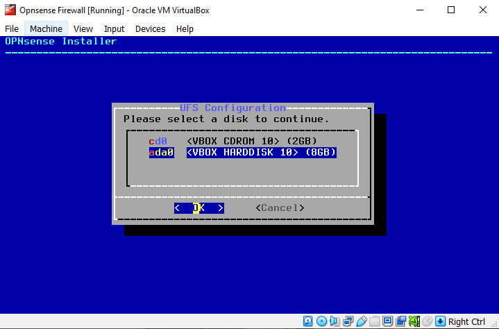
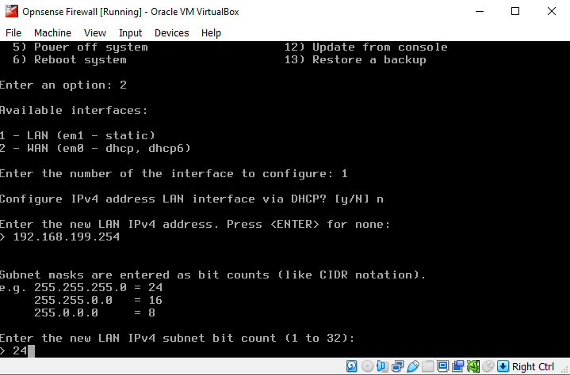

## Project Overview
This project provides a step-by-step guide on installing and deploying OPNsense, an open-source firewall that manages incoming and outgoing traffic to protect the network from cyber threats.

## Documentation
To download the OPNsense firewall, first access the OPNsense official website.  
You can click on this url to get into the website [https://opnsense.org/](https://opnsense.org/)
Then, follow these steps to install and deploy OPNsense:
1. Navigate to **Download** section on the navigation bar (You can look at the system requirements page on **Users -> Get started** to make sure your computer is compatible) 
  
2. While waiting for the download to complete, you can visit the [bzip2 website](https://gnuwin32.sourceforge.net/packages/bzip2.htm) to download bzip2, which is needed to uncompress the OPNsense file. To download bzip2, click the **Setup** link next to the **Complete  package** description, highlighted in purple. 
  Alternatively, you can use WinRAR to uncompress the file without needing bzip2. 
  If you are using WinRAR application, you can skip to step 8. 
  Please note that this bzip2 can only be used in the Windows platform. 
  
3. It’s good practice to compare the file hash with the hash provided on the official website to ensure the file hasn’t been corrupted or tampered with. On Windows, you can use the `Get-FileHash` command to generate the file hash. After obtaining the hash value, compare it manually with the hash listed on the website. 
   
4. Open the bzip2 setup wizard to begin the installation. Select **I accept the agreement**, then click the **Next** button..
   
5. Choose your preferred installation folder, or use the default folder as I did.
   
6. Select **Full installation** and click **Next**. Then, choose the Start Menu folder where you want the program’s shortcuts to be placed.
   
   
7. Next, follow the prompts until the installation is complete. Then, open **Windows Powershell** and navigate to the **bin** folder of the bzip2 installation. Run the application with the **-d** flag followed by the OPNsense downloaded file `.\bunzip2.exe -d <file path>`.
   
8. The uncompressed file will appear as follows: 
   
9. Next, create the OPNsense virtual machine using the ISO image. I am using Oracle VirtualBox for this installation, but you can use any virtual machine application of your choice. 
   After clicking the **Create** button, specify the name, folder, and path to the ISO image. Set the VM type to **BSD** and select **FreeBSD (64-bit)** as the version, as OPNsense is based on FreeBSD.
   
10. Allocate a minimum of 2048 MB of memory and 2 CPUs to ensure optimal performance.
   
11. Create a Virtual Hard Disk with a minimum size of 8 GB.
   
12. Review the settings and click the **Finish** button.
   
13. Before starting the OPNsense virtual machine, configure the network settings. I am using two types of networks: **NAT** and **Host-only Adapter**. This setup allows the firewall to capture traffic from both the internet and the internal network, including the host.  
    In VirtualBox, access the network settings by going to **Settings** and then the **Network** tab. Ensure **Enable Network Adapter** is checked. For the first adapter, select **NAT**, and for the second adapter, choose **Host-only Adapter**.
   
   
14. Start the OPNsense virtual machine and wait for it to fully boot up. Once it’s ready, provide the login credentials: 
   **login: installer** 
   **Password: opnsense** 
   
15. Select **Continue with default keymap**, then choose **Install (UFS)** and select **ada0** as the hard disk for the file system.  
    Finally, reset the contents of the disk.  
   
   
   
   
16. Wait for the installation to complete. You can then either change the root password or finish the installation. For enhanced security, it is recommended to change the default root password.
   
   
17. While the virtual machine is rebooting, remove the ISO disk from the virtual drive by going to **Devices** -> **Optical Drives** -> **Remove disk from virtual drive**. 
   In the image, this option is highlighted in grey because the disk was removed before taking the screenshot.
   
18. Then, log in with the root account. You will see various options for configuring the firewall.  
   First, select option 1 to assign the interfaces. Choose **No/n** for LAGGs (Link Aggregation Groups, similar to EtherChannel in Cisco for aggregating network links) and VLANs configuration. 
     
   For the WAN and LAN interfaces, assign **em0** to the WAN interface and **em1** to the LAN interface. Press Enter for the Optional interface to continue without providing additional input. 
   
     
   Then, proceed to set up the interfaces. 
   
19. After assigning the interfaces, assign IP addresses to the LAN interface by choosing option 2.
     
    I am using a static LAN IP address to ensure consistent access to OPNsense without changes over time. 
   The IP address used is within my subnet, but you should select an IP address that fits your own network. 
    
   We are not configuring the WAN interface because the firewall will be used within a home network, and IPv6 is not in use. 
   The Web GUI protocol does not affect firewall access, even if you use HTTPS, it will default to HTTP due to the certificate not being issued by a certificate authority. 
    
20. If everything has been set, we can access the OPNsense GUI in the web browser and type the static IP address that already set. 
   Then, we can use the root account to login to the website.
    
   The first step is to check for updates by navigating to **Firmware -> Updates**. Next, go to the **Plugins** section, located next to **Updates**, to download the VirtualBox plugins, which include the Guest Additions extension to ensure OPNsense runs smoothly.
    
    
21. Finally, the firewall will be up and running when you return to the **Lobby -> Dashboard**. You can add widgets to suit your preferences.
   
