## Project Overview and Infrastructure
This project simulates a SSH Brute Force Attack on a server and the detection of such an attack by Wazuh. Additionally, it demonstrates how to protect the server from these attacks using Wazuh. To protect the attack, we will use active response module from Wazuh with firewall drop script.

Here are the infrastructures I used to simulate the intended environment:
<table>
  <thead>
    <tr>
      <th>Endpoint</th>
      <th>Description</th>
    </tr>
  </thead>
  <tbody>
    <tr>
      <td>Kali Linux in VMWare VM</td>
      <td>This is the attacker endpoint that performs the SSH brute force attack</td>
    </tr>
    <tr>
      <td>Ubuntu 24.04 in VirtualBox VM</td>
      <td>This is the victim endpoint that will receive the SSH brute force attack</td>
    </tr>
    <tr>
      <td>Windows 10</td>
      <td>This is the host machine that holds the virtual machines</td>
    </tr>
    <tr>
      <td>Docker Container</td>
      <td>This is where Wazuh operates (I am using Docker because it is lightweight)</td>
    </tr>
  </tbody>
</table>

The image below shows the network diagram of the environment. 

The attack will start from the attacker's IP address (<strong>192.168.199.129</strong>) targeting the host machine's port 2222. The host machine's IP address (<strong>192.168.0.74</strong>) will act as the intermediary for the attack on the server because I am using port forwarding from the server's port 22 to port 2222. Port forwarding is used because the attacker and victim machines are on different virtual machine software.

The Wazuh Dashboard can also be accessed from the host machine's IP address.

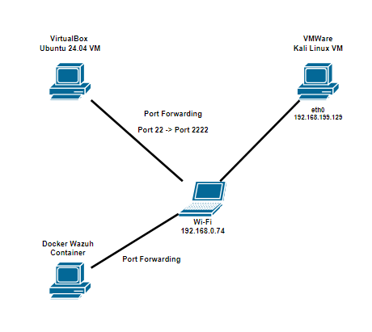

## Documentation
### Environment
The first thing I did was log in to the Wazuh Dashboard using a web browser.

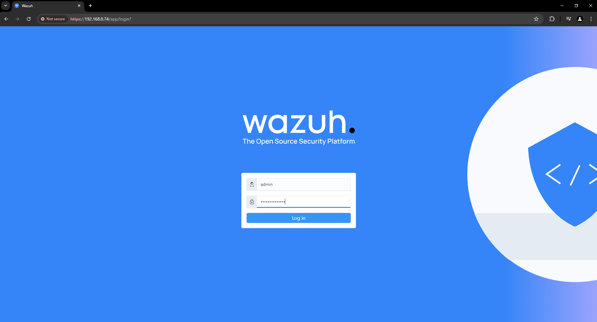

After logging into the dashboard, you will see an overview of the devices connected to Wazuh. To access the **Endpoint Summary** and see the device that will be the victim in this simulation, click the menu options in the top left corner of the page and scroll down to **Server Management**, you will see the Endpoints Summary.

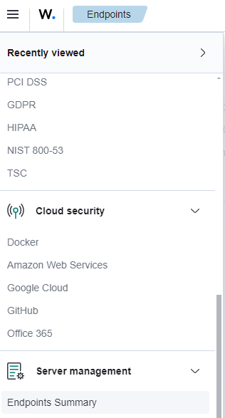

There are two devices linked to my Wazuh instance. As I mentioned before, we will use the Ubuntu 24.04 server as the victim. 

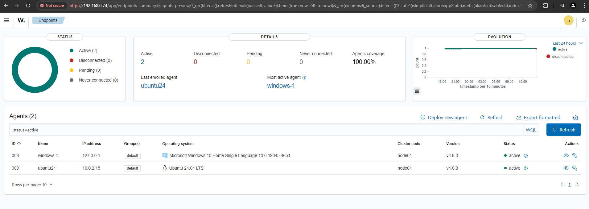

Next, I examined the **ubuntu24** endpoint traffic in more detail. We could see some events occurring and the device's compliance with standards.

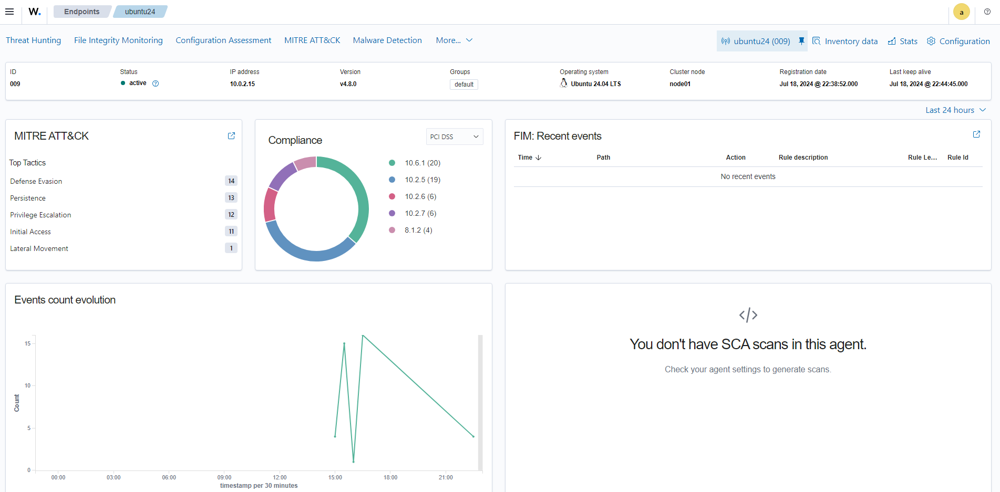

Now, let's dive deeper into the events recorded by Wazuh. Go to the menu again, navigate to **Threat Hunting**, and select **Events**. Here, we can see the events in more detail. Expanding the dropdown will show the details of the selected event. There is also a search bar that we can use to filter the events for specific ones we want to investigate.

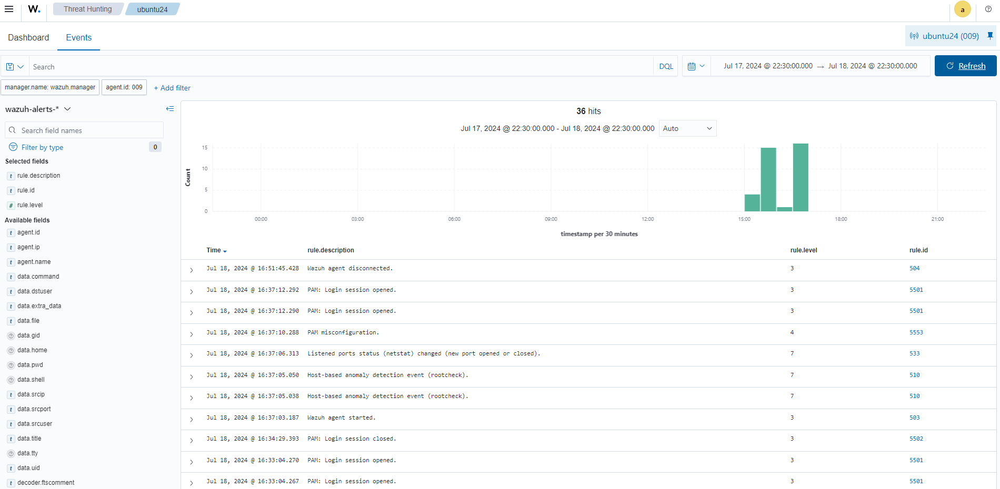

After exploring the Wazuh environment, I will demonstrate how to set up port forwarding rules in VirtualBox.
First, go to VirtualBox **Settings**, choose **Network**, expand the **Advanced** dropdown, and click the **Port Forwarding** button. Click the plus button on the right side of the pop-up box, then fill in the Name, Protocol, Host Port, and Guest Port as shown in the image below or customize them to your preference. Since I wanted to simulate an SSH Brute Force attack, I configured the port to SSH port (22).

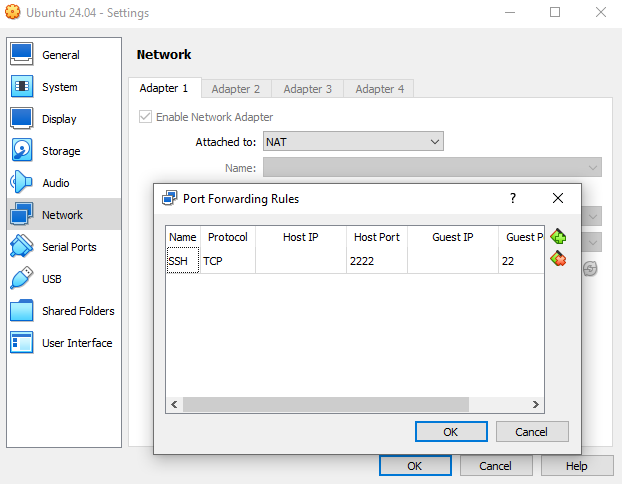

Then, I tested whether the server was working by using the ssh command from the attacker machine.

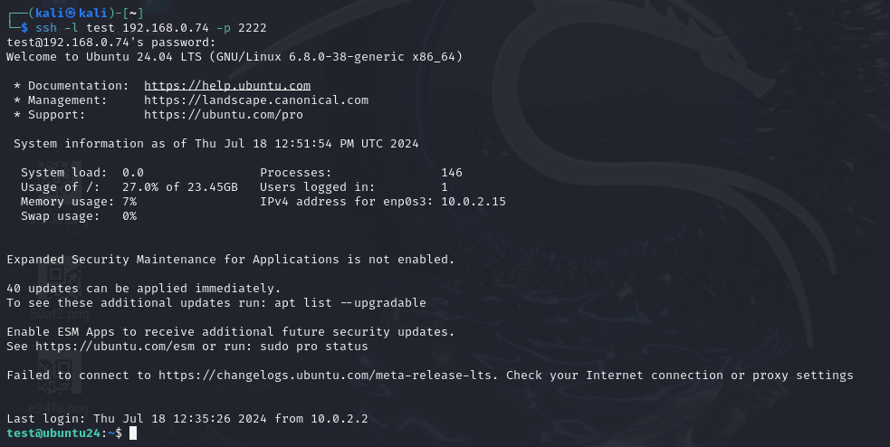

### Simulation
Now, let's attack the victim.
I used Hydra as a brute force tool and a common wordlist, rockyou.txt.

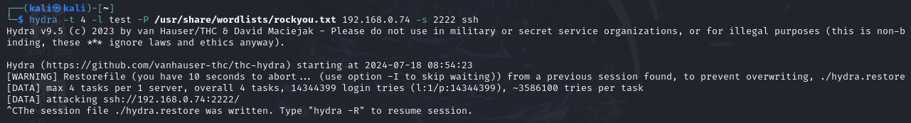

Let the tool run. Subsequently, we can identify that the attack is being detected by Wazuh in the **Events** Dashboard. In the image below, a rule description states **"sshd: authentication failed"**, indicating that the attack is working but unsuccessful.

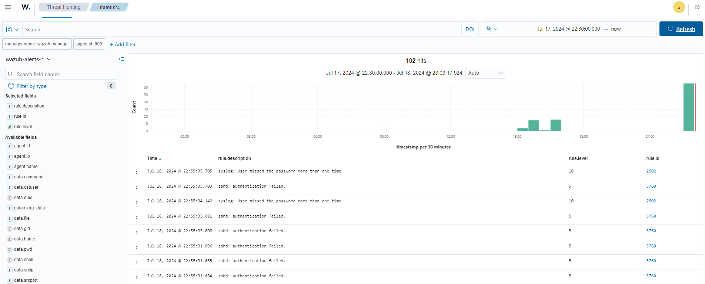

To protect the server from the attack, edit the ossec configuration and apply the **firewall-drop** command to the SSHD brute force rule ID (5763). Editing the configuration can be accessed by navigating to **Settings** under **Server Management**, then selecting **Edit Configuration** on the top left. Write down the configuration as shown in the image below.

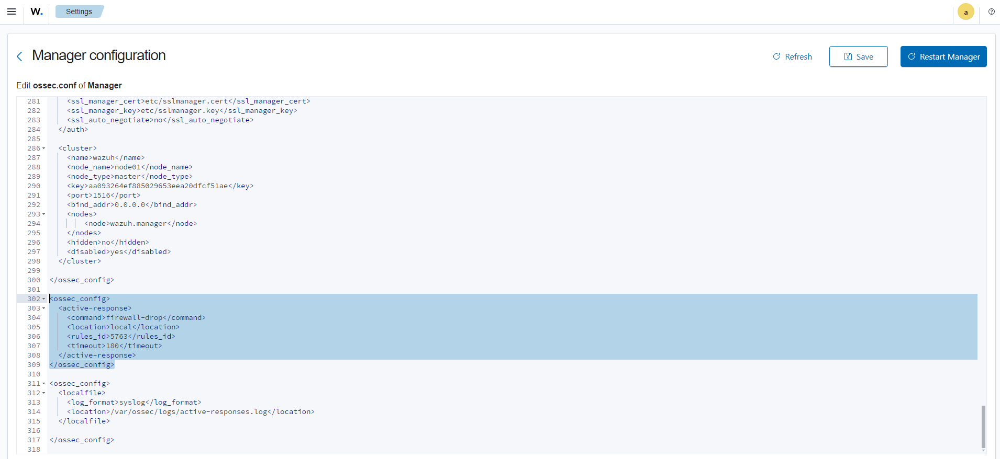

Then, try the attack again. It will say "host blocked by firewall-drop." Expand the event to get more information. We can see the output and confirm that it is a Brute Force attack.

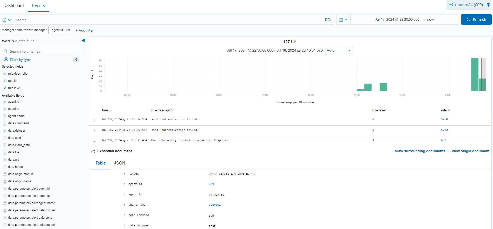

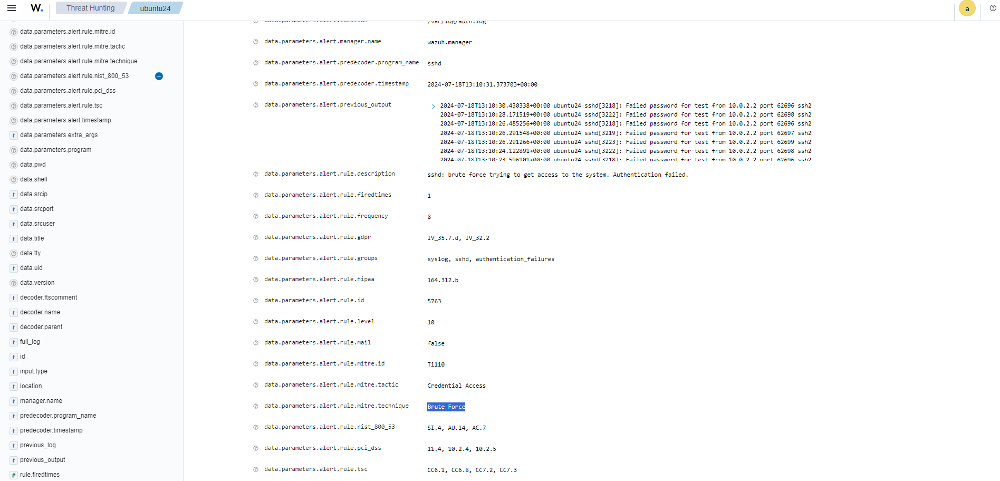
