## DNS Spoofing Analysis Using Splunk Enterprise
### Overview
This project demonstrate how to analyse DNS spoofing attack data using Splunk. After simulating a DNS spoofing attack and capturing network traffic with Wireshark, the data is converted to CSV and imported into Splunk for analysis. While it's not an in-depth analysis, it helps identify key patterns and behaviors typical of a DNS spoofing attack.  

### Requirements
- Splunk installed and running locally.
- Wireshark to capture network traffic.
- Pcap file converted to CSV format for analysis.

### Analysis Steps
1. Use the **Add Data** option in Splunk and select the CSV file containing the captured network data.  
   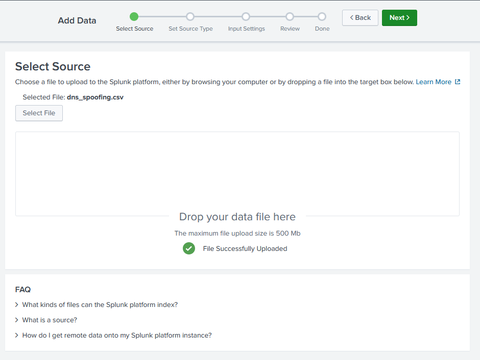
2. Ensure that the data from the CSV file is correctly recognised by Splunk. Then, click **Save As** to set the Name, Description, Category, and App. For this project, we will be using the **Search & Reporting** App.  
   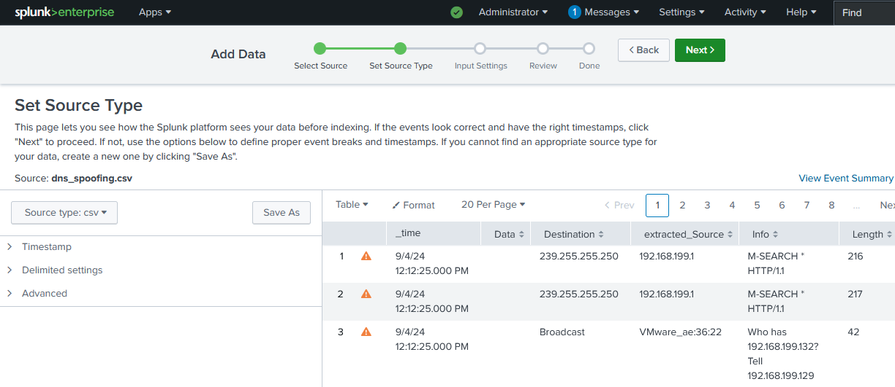
3. Provide a name and description for the data, and select the appropriate Category and App.
   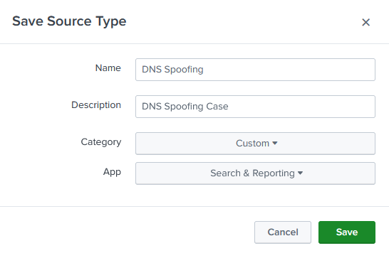
4. You can modify the host field if necessary, but it's optional. Once everything is set, proceed to the **Review** step and then click **Done**.  
   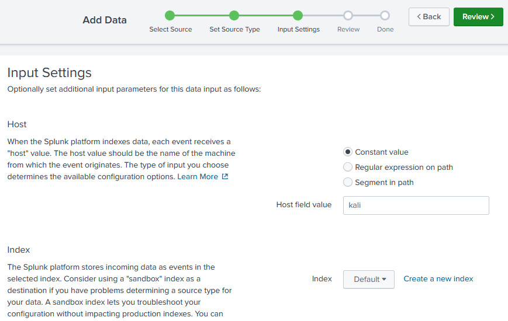
5. Once the setup is complete, click on the **Start Searching** button to begin your analysis in Splunk.
   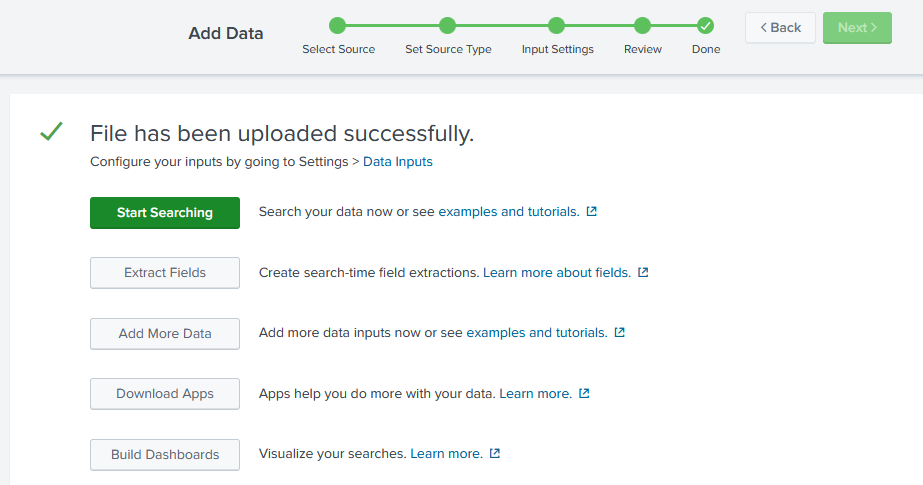
6. Now, we can see many events being logged, and we can filter them using the fields on the left sidebar. To make our analysis more focused, we can add more fields to filter the events more specifically. For example, in the picture, we’re only seeing events related to ARP protocol, but by adding more fields, we can include DNS traffic, IP addresses, or other important details. This helps us identify patterns linked to the DNS spoofing attack more easily.  
   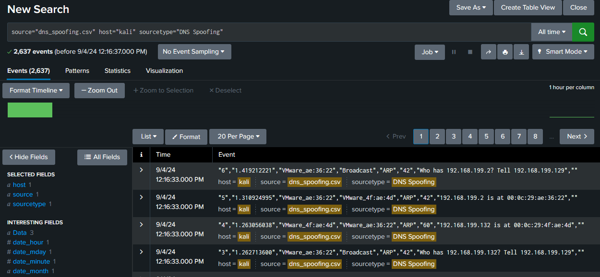
7. Select one event to use as a sample.  
   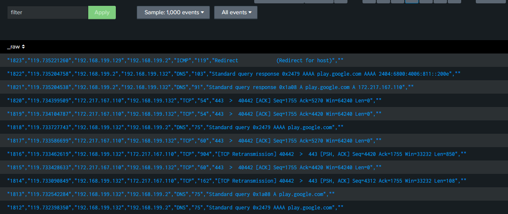  
   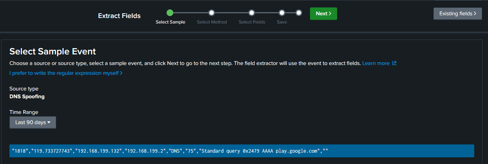  
8. Choose "Regular Expression" as the selection method.  
   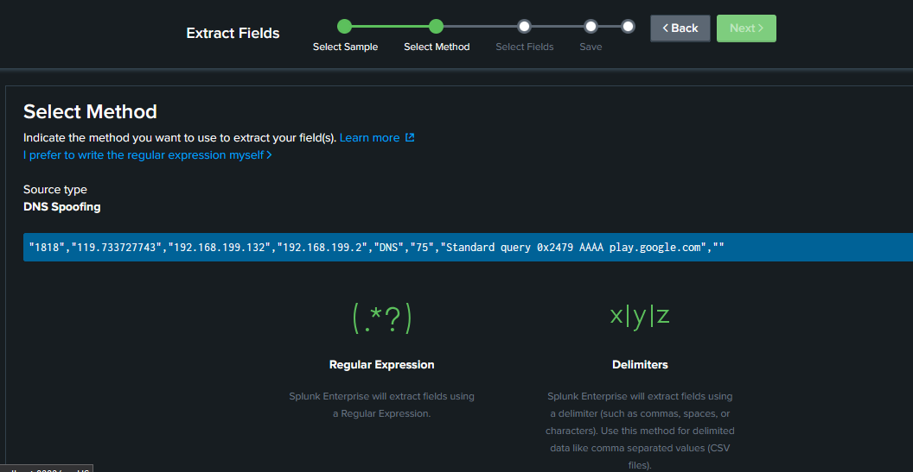  
9. Assign tags to the chosen fields. In the example below, I used four tags: **src_ip** (source IP), **dst_ip** (destination IP), **protocol**, and **fqdn** (fully qualified domain name as the domain).  
   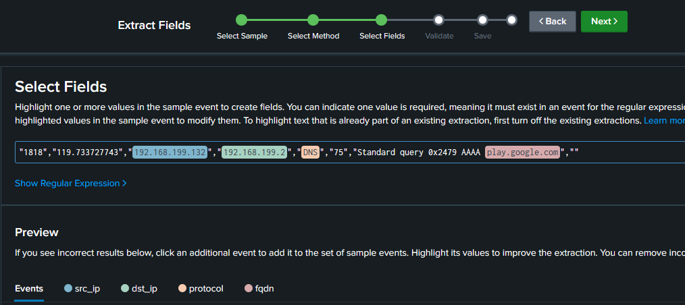  
10. Save the extracted fields to filter the data more effectively.  
   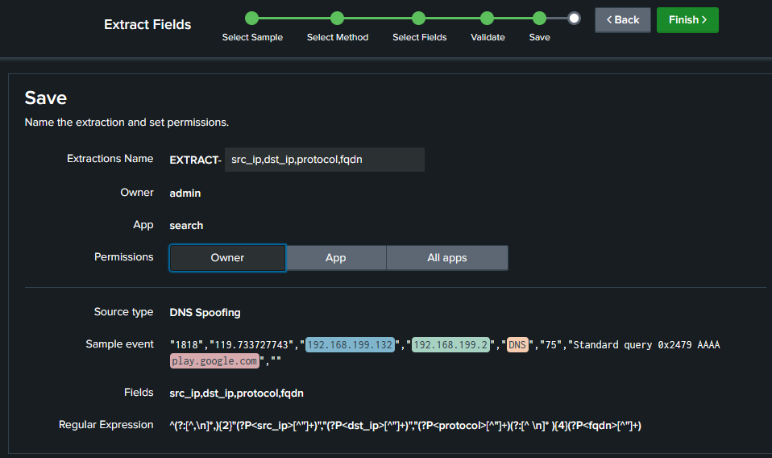  
11. Once the field extraction is complete, navigate to **Explore the fields I just created in Search**.  
   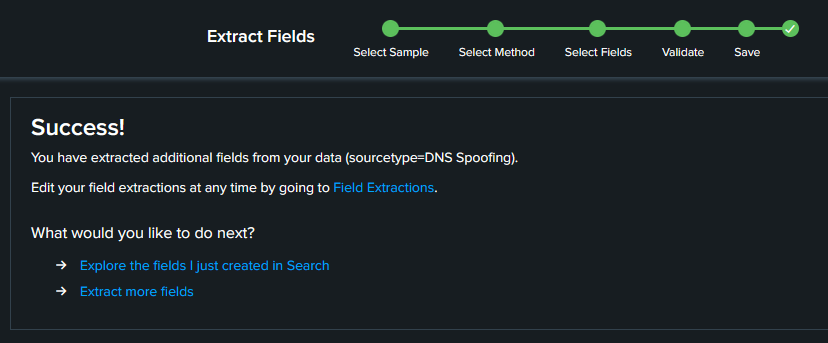
12. We begin the analysis. The events are now grouped by protocol, which allows for more precise filtering.  
   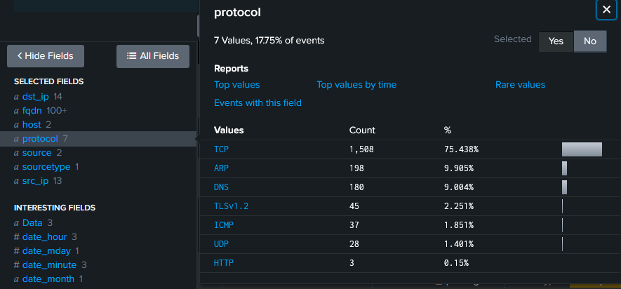
13. Next, I examined the IP addresses involved in the network activity. There are only two IP addresses that are communicating (**192.168.199.132** and **192.168.199.2**).  
   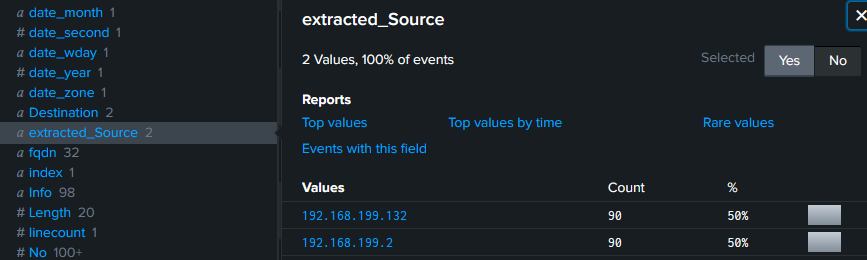  
14. To understand the scope of the attack, I looked at all Fully Qualified Domain Names (FQDN) involved. The domain information helps identify the target of the DNS spoofing.  
   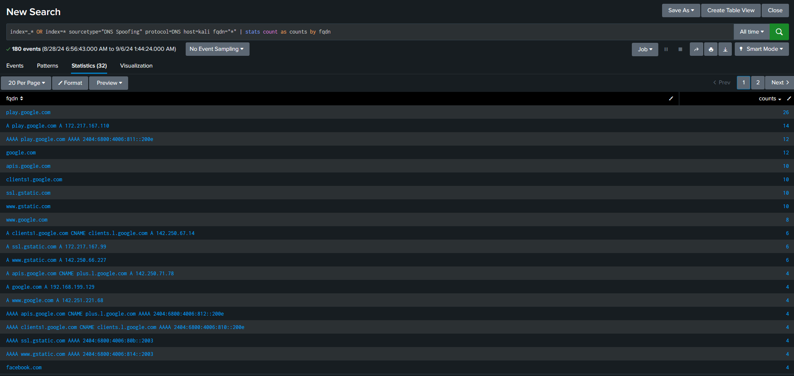  
   On page 1, we see numerous requests to Google, but these requests are resolved to IP addresses outside the **192.168.199.0/24** range (the IP address range used in the [attack simulation](https://github.com/elvanalandi/Cyber-Attack-Simulations/tree/main/DNS%20Spoofing)), meaning the DNS spoofing attack for google failed.  
   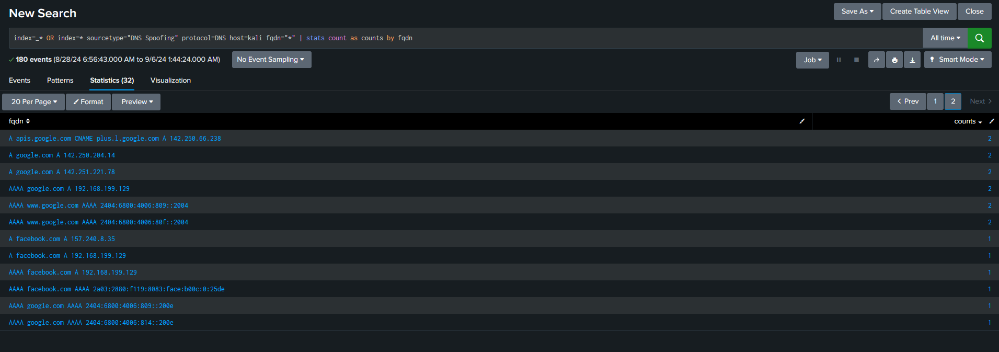  
   However, on page 2, there are DNS requests for **facebook.com** that resolve to **192.168.199.129**,an IP address within the attacker's network range (`AAAA facebook.com A 192.168.199.129`). This indicates that **facebook.com** was successfully spoofed.  
15. To further investigate, I filtered the events specifically for the **facebook.com** domain.  
   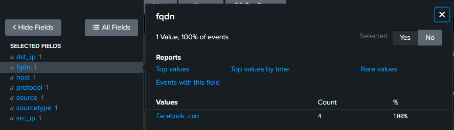  
16. Upon analysing the event data, I noticed the following:
    - The destination address for the **facebook.com** request is **192.168.199.2** (the gateway).
    - The source address is **192.168.199.132** (the victim's machine).
    - From the previous findings, **192.168.199.129** is the attacker, acting as a man-in-the-middle, intercepting and altering DNS responses.  
This confirms the DNS spoofing attack, where **192.168.199.129** successfully redirected the victim's traffic for **facebook.com** to a fake site hosted by the attacker.  
   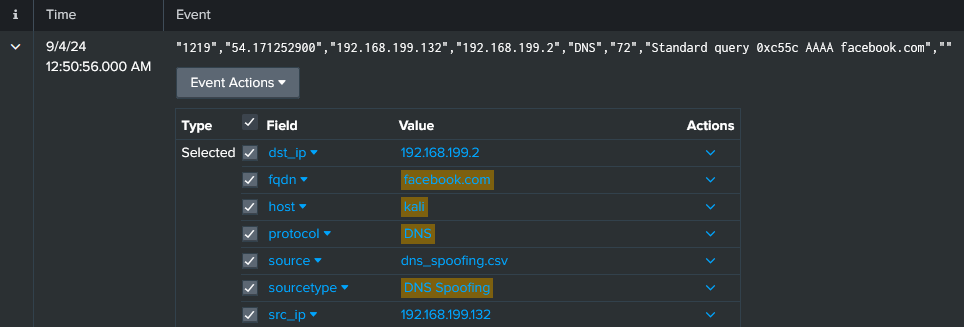  
