## Mimikatz Detection Using Sysmon and Windows PowerShell Event in Splunk
### Table of Contents
- [Overview](#overview)  
- [Requirements](#requirements)  
- [Mimikatz Behavior](#mimikatz-behavior)  
- [Mimikatz Detection Strategy](#mimikatz-detection-strategy)
- [Preparation](#preparation)
- [Mimikatz Simulation](#mimikatz-simulation)
- [Mimikatz Detection Dashboard](#mimikatz-detection-dashboard)
- [Field Extraction using Regex](#field-extraction-using-regex)
- [References](#references)
    
### Overview
This project demonstrates how to detect credential dumping attacks using Mimikatz. Mimikatz is a powerful open-source tool widely used by attackers to extract plaintext passwords, hashes, PIN codes, and Kerberos tickets from Windows memory, enabling credential dumping attacks. Detecting Mimikatz activity is crucial for identifying advanced intrusions and preventing lateral movement within networks.  

### Requirements
- Windows VM
- Splunk Enterprise server
- Splunk Universal Forwarder installed on Windows host
> **ℹ️ Info:** If you haven’t ingested Windows logs into Splunk yet, check out my [Windows Logs Ingestion project](https://github.com/elvanalandi/Home-Cybersecurity-Lab/tree/main/Splunk/Windows%20Logs%20Ingestion).

### Mimikatz Behavior
Mimikatz can perform various credential dumping techniques, such as Pass-the-Hash and Pass-the-Ticket attacks.  
Below are some of its key functionalities:  
- Dumps login credentials from LSASS memory
- Performs Pass-the-Hash attacks on NTLM hashes
- Executes Pass-the-Ticket attacks using Kerberos tickets
- Dumps SAM database hashed
- Manipulates tokens for privilege escalation or impersonation
- Simulates a domain controller to replicate account credentials (DCSync attack)
- Loads and injects DLLs to interact with system security components and extract credentials
With those capabilities, Mimikatz frequently interacts with `lsass.exe`, loads sensitive DLLs, and carries out operations that require elevated memory access rights.  
Mimikatz is categorized as a post-exploitation tool because it requires prior access to the system. It is often combined with other tools and techniques like Cobalt Strike to bypass security defenses and evade detection.

### Mimikatz Detection Strategy
To detect these behaviors, we can focus on the following patterns:  
- **Suspicious memory access to LSASS** (`lsass.exe`)  
  Detected via Sysmon Event ID 10  (Process Access) or Windows Security Event ID 4688 (Process Creation).  
- **DLL injection or loading**  
  Detected via Sysmon Event ID 7 (Image Loaded).  
- **Suspicious command-line activity**  
  Detected via Sysmon Event ID 1 (Process Creation) or Windows Security Event ID 4656 (Handle Manipulation).  
- **PowerShell script execution and logging**  
  Detected via PowerShell Script Block Logging — Event ID 4104.  
- **Token manipulation**  
  Detected via Windows Security Event ID 4703 (Token Right Adjusted).
- **Pass-the-Hash attack**  
  Detected via Windows Security Event ID 4624 (Logon Successful).
- **Pass-the-Ticket attack on Kerberos**  
  Detected visa Windows Security Event ID 4769 (A Kerberos service ticket was requested).

### Preparation
> **ℹ️ Info:** For now, I use only Sysmon and PowerShell Script Block Logging to detect Mimikatz. I plan to add more Windows Security Event IDs in the future to reduce false positives.
1. **Configure Sysmon Event ID 10**  
   To collect Event ID 10 (Process Access), you need to modify the Sysmon configuration.  
   Add the following code inside the <ProcessAccess> tag to monitor access to lsass.exe:  
   ```
   <TargetImage condition="is">C:\Windows\System32\lsass.exe</TargetImage>
   ```
   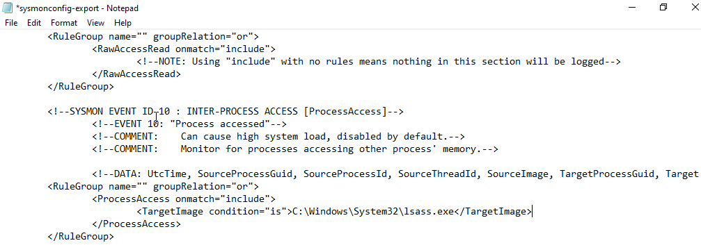  
   Then, navigate to the Sysmon installation directory and run the following command to apply the updated configuration (replace the file name with your actual config file):  
   ```
   Sysmon64.exe -c sysmonconfig-export.xml
   ```
2. **Configure Sysmon Event ID 7**
   To collect Event ID 7 (Image Load), add the following entries inside the `<ImageLoad>` tag in your Sysmon configuration:
   ```
   <Image condition="end with">lsass.exe</Image>
   <ImageLoaded condition="contains">cryptbase.dll</ImageLoaded>
   <ImageLoaded condition="contains">hid.dll</ImageLoaded>
   <ImageLoaded condition="contains">imm32.dll</ImageLoaded>
   <ImageLoaded condition="contains">kernel32.dll</ImageLoaded>
   <ImageLoaded condition="contains">msctf.dll</ImageLoaded>
   <ImageLoaded condition="contains">ntdll.dll</ImageLoaded>
   <ImageLoaded condition="contains">sechost.dll</ImageLoaded>
   <ImageLoaded condition="contains">shell32.dll</ImageLoaded>
   <ImageLoaded condition="contains">user32.dll</ImageLoaded>
   <ImageLoaded condition="contains">wininet.dll</ImageLoaded>
   <ImageLoaded condition="contains">WinSCard.dll</ImageLoaded>
   <ImageLoaded condition="contains">cryptdll.dll</ImageLoaded>
   <ImageLoaded condition="contains">samlib.dll</ImageLoaded>
   <ImageLoaded condition="contains">vaultcli.dll</ImageLoaded>
   ```
   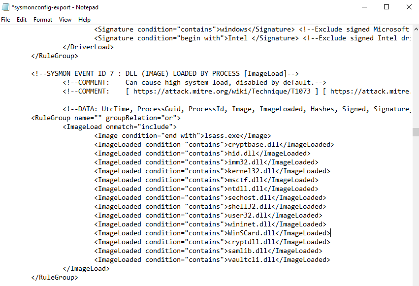  
   Finally, update the Sysmon configuration using the appropriate command:
   ```
   Sysmon64.exe -c sysmonconfig-export.xml
   ```
3. **Configure module logging for PowerShell**  
   - Open the **Group Policy Editor** by pressing `Windows+R`, typing `gpedit.msc` and pressing Enter  
   - Select **Computer Configuration** > **Administrative Templates** > **Windows Components** > **Windows PowerShell**  
   - Double-click **Turn on Module Logging** and set it to **Enabled**
   - In the **Options** section, click the **Show** button
   - Enter `*` or `*=*` as the module name to record all PowerShell modules  
   - Click **OK** on all open windows to apply the changes  
   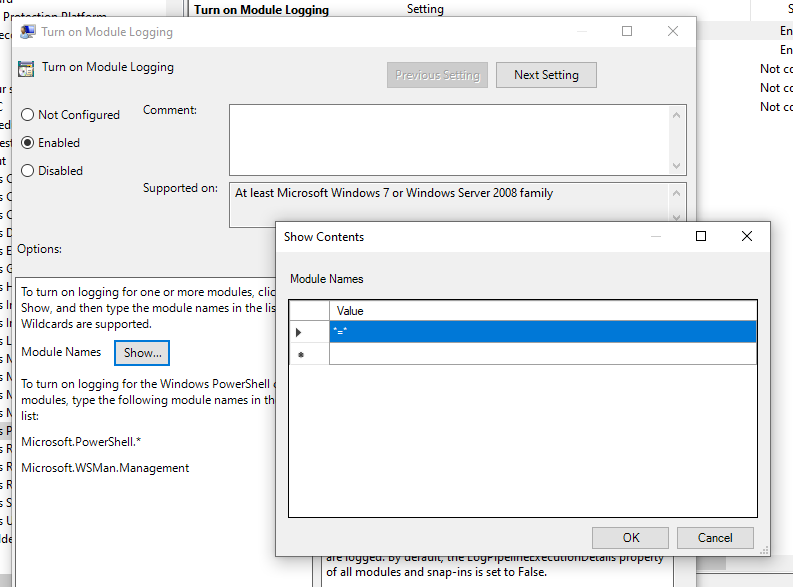  
4. **Configure script block logging for PowerShell**  
   - Still within the **Windows PowerShell** GPO settings, double-click **Turn on PowerShell Script Block Logging** and set it to **Enabled**  
   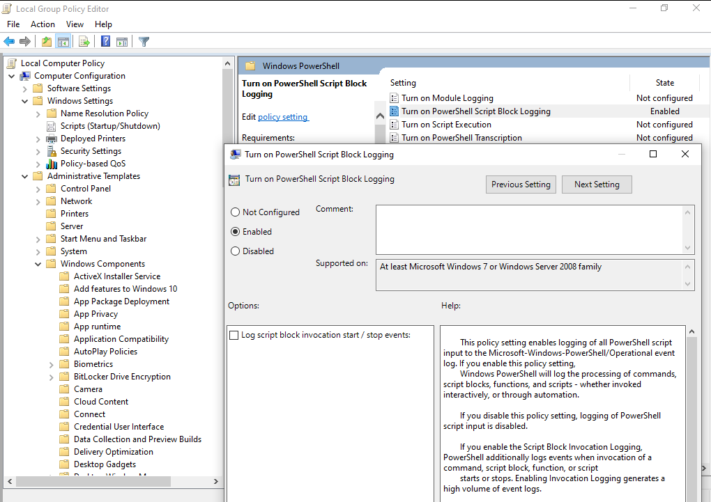  
   - Additionally, to enable **Event ID 4688** (Process Creation), configure **Audit Process Creation**:
     Go to  **Computer Configuration** > **Windows Settings** > **Security Settings** > **Advanced Audit Policy Configuration** > **System Audit Policies** > **Detailed Tracking**  
     Double-click **Audit Process Creation**,  set it to **Enabled**, and check **Configure the following audit events** > **Success**  
    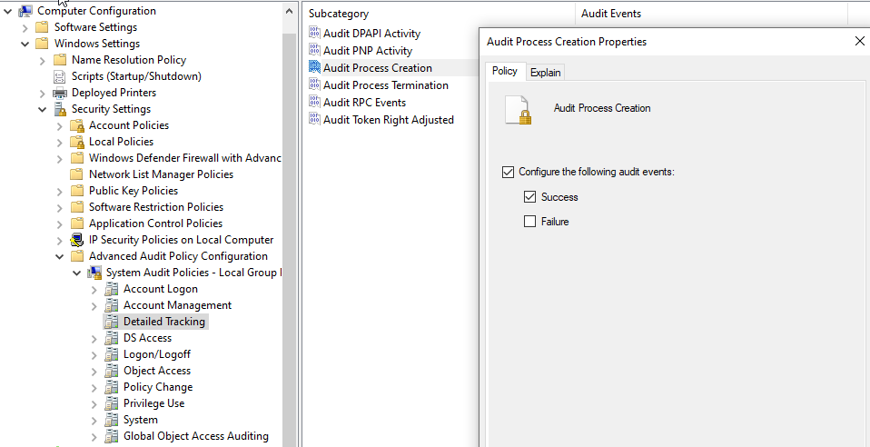
5. **Configure transcription logging**
   - In **Windows PowerShell** GPO settings, enable **Turn on PowerShell Transcription**
   - Set the **Transcript output directory**  to your preferred directory path
   - Enable **Include invocation headers** for more detailed context  
   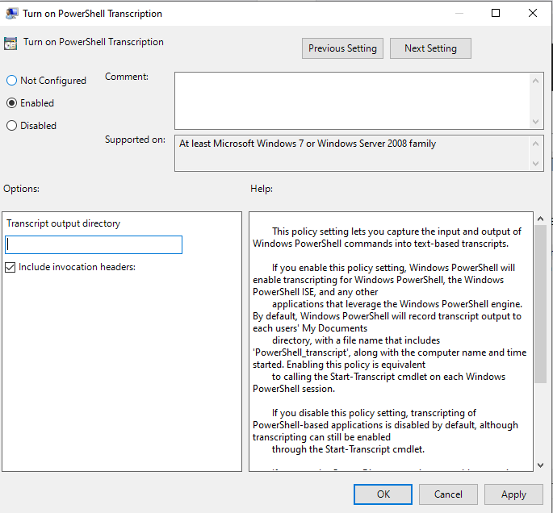
6. **Enable monitoring to the Transcription Logging**  
   Navigate to the following path:  
   ```
   C:\Program Files\SplunkUniversalForwarder\etc\system\local\inputs.conf
   ```
   > If the file doesn't exist yet, create it manually in that directory.
     
   In the `inputs.conf` file of the Splunk Forwarder, add the following configuration:  
   ```
   [monitor://<your transcription folder path>]
   disabled = 0
   index = powershell
   sourcetype = PowerShellTranscript
   recursive = true
   ```
   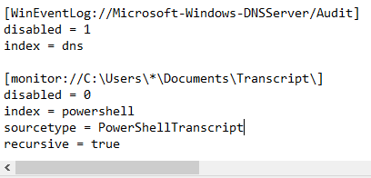  

### Mimikatz Simulation
> ⚠️ Warning: This simulation should only be performed in a properly isolated and controlled lab environment.  
> I do not take any responsibility for any misuse, damage, or consequences resulting from the use of this content. Proceed at your own risk.
Mimikatz is often executed alongside other tools to increase stealth and evade detection. However, in this lab, I run it standalone to focus on detection techniques.  
1. **Turn Off Windows Defender (Virus & Threat Protection)**  
   Search for **Firewall & network protection** using the Windows search bar.  
   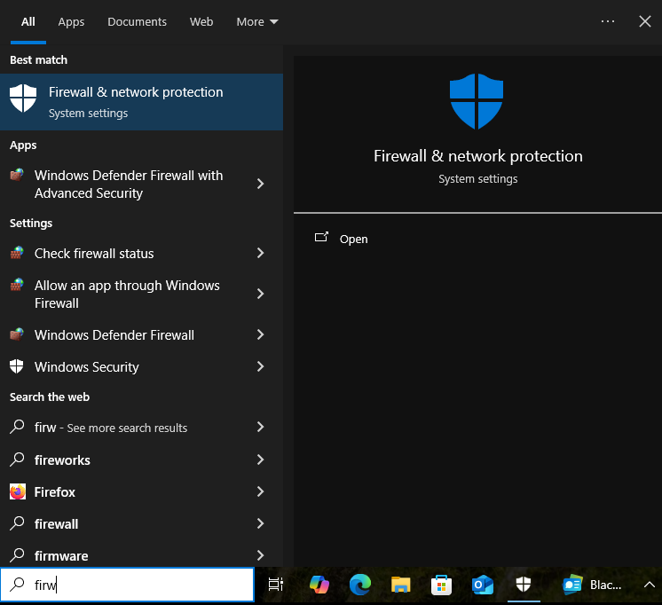  
   Then, turn off **Real-time protection** by clicking the toggle switch.  
   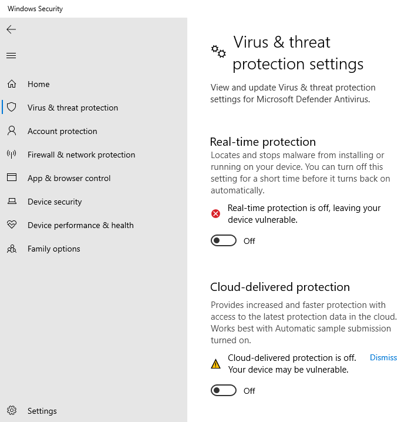  
2. **Download Mimikatz**  
   You can download Mimikatz from [this ParrotSec repository](https://github.com/ParrotSec/mimikatz/tree/master) or from the [original creator](https://github.com/gentilkiwi/mimikatz/).  
3. **Run Mimikatz**  
   Open PowerShell and navigate to the folder containing Mimikatz  
   Then, run the following command to launch it with administrator privileges:  
   ```
   Start-Process .\mimikatz.exe -Verb RunAs
   ```
   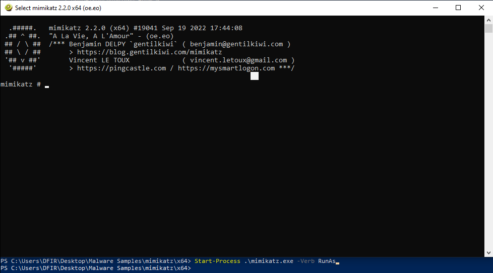  
4. **Explore Mimikatz Commands**
   If you have a Domain Controller and Kerberos server, you can simulate attacks like DCSync and Pass-the-Ticket.  
   Since my current lab setup doesn’t include those, I’ll only demonstrate basic credential dumping commands.  
   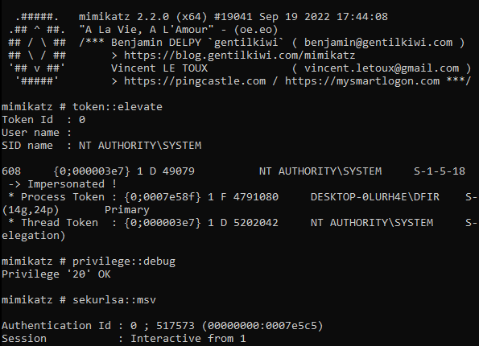
   For more information on Mimikatz commands, this source provides some commands of [Mimikatz](https://happycamper84.medium.com/mimikatz-cheatsheet-ad2b88059b4) in details.  

### Mimikatz Detection Dashboard
1. **Open Splunk Dashboards**
   Go to the **Dashboards** tab and click **Create New Dashboard**.  
   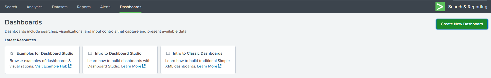
2. **Create a New Dashboard**
   Fill in the **Dashboard Title** and choose the dashboard type. In this example, I’m using **Classic Dashboards**.
   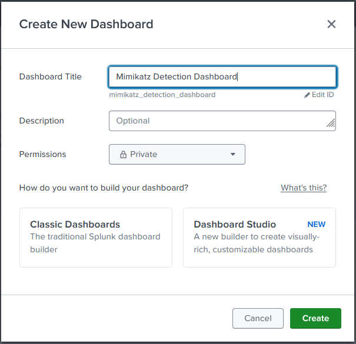
3. **Add Time Input**
   Add a time range picker so users can filter results dynamically.
   Click **+ Add Input**, select **Time**, set the label to **Time**, and the Token to **time**.
   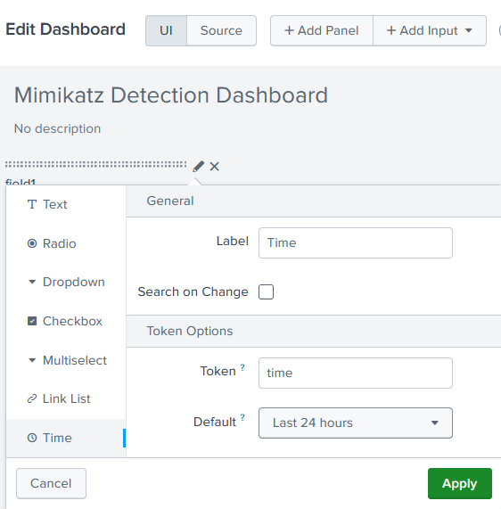  
4. **Add Panel**  
   Click **+ Add Panel** and choose a panel type. I selected a **Statistics Table**, as it's already informative.  
   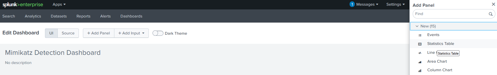  
5. **Script Block Logging Panel (Event ID 4104)**  
   This panel detects PowerShell-based Mimikatz activity using Event ID 4104.
   Use the following SPL query:  
   ```
   index=* (source=WinEventLog:Microsoft-Windows-PowerShell/Operational OR source="XmlWinEventLog:Microsoft-Windows-PowerShell/Operational" OR source=WinEventLog:PowerShellCore/Operational OR source="XmlWinEventLog:PowerShellCore/Operational") EventCode=4104 | where match(ScriptBlockText, "(?i)mimikatz|-dumpcr|sekurlsa::pth|kerberos::ptt|kerberos::golden") | fillnull  | stats count min(_time) as firstTime max(_time) as lastTime values(UserID) as UserID values(ScriptBlockId) as ScriptBlockId values(EventCode) as EventCode values(Guid) as Guid values(Opcode) as Opcode values(Path) as Path values(ProcessID) as ProcessID by ScriptBlockText | eval firstTime = strftime(firstTime, "%Y-%m-%d %H:%M:%S") | eval lastTime = strftime(lastTime, "%Y-%m-%d %H:%M:%S")
   ```
   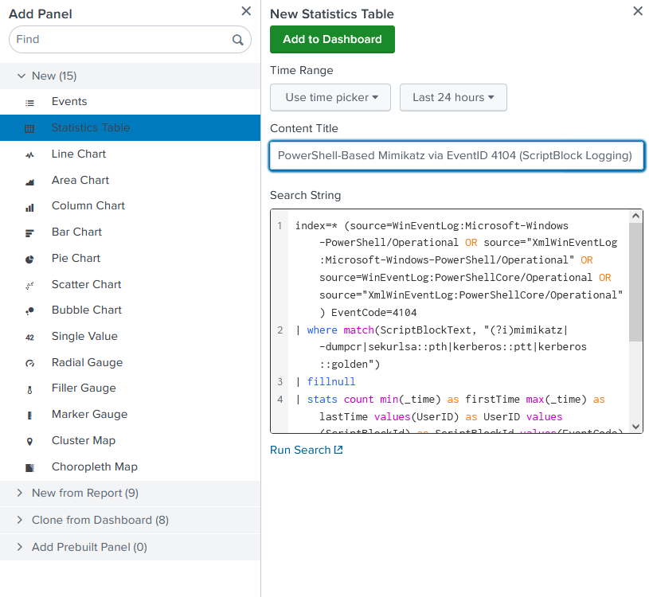  
   Afterward, click **Add to Dashboard**.  
   Set the Time Range to **Shared Time Picker** using the token `time`.  
   If you've already created the panel, you can still edit it to apply the shared time setting.  
   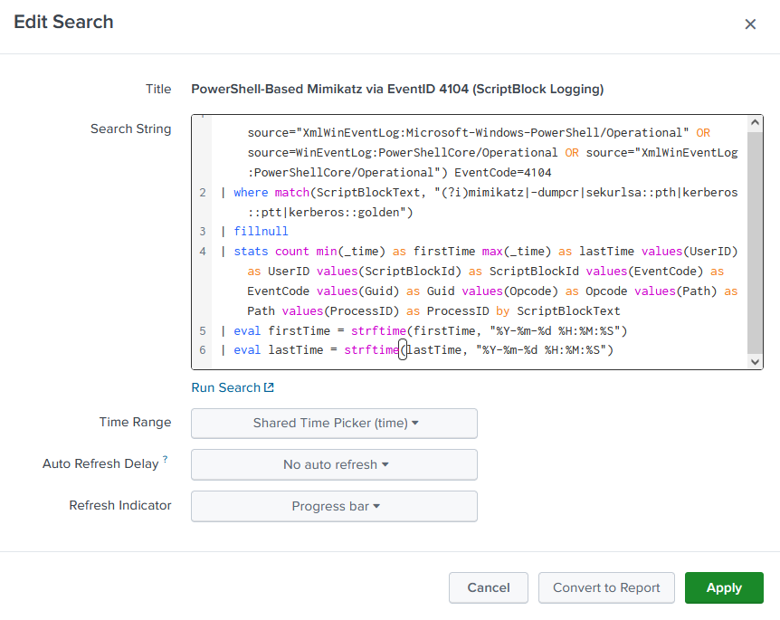  
   In the result, we can see the process ID and the scripts that were executed, which are related to Mimikatz. You can also change the Time widget as the input.  
   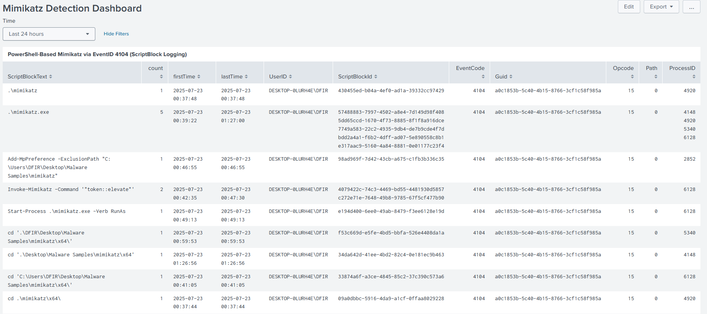  
6. **Process Creation Panel (Sysmon Event ID 1)**  
   This panel detects suspicious command-line activity via Sysmon Event ID 1. I included hash values so you can investigate them using VirusTotal.  
   ```
   index=* sourcetype=XmlWinEventLog:Microsoft-Windows-Sysmon/Operational EventCode=1 | where match(CommandLine, "(?i)mimikatz|-dumpcr|sekurlsa::|kerberos::|golden|lsadump::") | stats count min(_time) as firstTime max(_time) as lastTime values(Image) as Images values(CommandLine) as Commands values(User) as Users values(host) as Hosts values(Hashes) as Hashes by ParentImage | eval firstTime = strftime(firstTime, "%Y-%m-%d %H:%M:%S") | eval lastTime = strftime(lastTime, "%Y-%m-%d %H:%M:%S")
   ```
   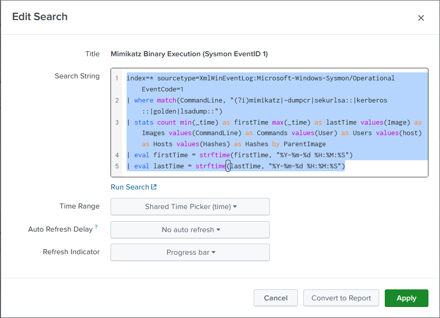  
   Here, we can see that **Mimikatz** was executed under **PowerShell**, shown as the ParentImage.  
   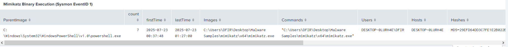  
7. **DLL Injection Panel (Sysmon Event ID 7)**  
   This panel detects common DLLs often associated with Mimikatz, as configured in Sysmon.  
   ```
   index=* sourcetype=XmlWinEventLog:Microsoft-Windows-Sysmon/Operational EventCode=7 | where match(ImageLoaded, "(?i)\\\\(samlib\.dll|vaultcli\.dll|cryptdll\.dll|cryptbase\.dll|hid\.dll|imm32\.dll|kernel32\.dll|msctf\.dll|ntdll\.dll|sechost\.dll|shell32\.dll|user32\.dll|wininet\.dll|winscard\.dll)$") 
   AND match(Image, "(?i)lsass|mimikatz") | stats count min(_time) as firstTime max(_time) as lastTime values(ImageLoaded) as ImageLoaded values(ProcessId) as ProcessId values(ComputerName) as ComputerName by Image | eval firstTime = strftime(firstTime, "%Y-%m-%d %H:%M:%S") | eval lastTime = strftime(lastTime, "%Y-%m-%d %H:%M:%S")
   ```
   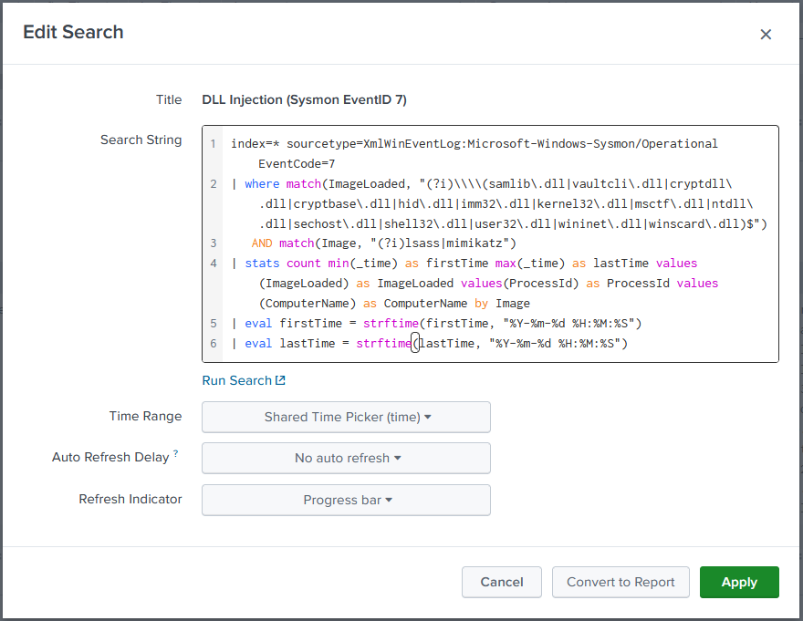  
   Among 14 common DLLs used by **Mimikatz**, 11 were matched in this simulation.  
   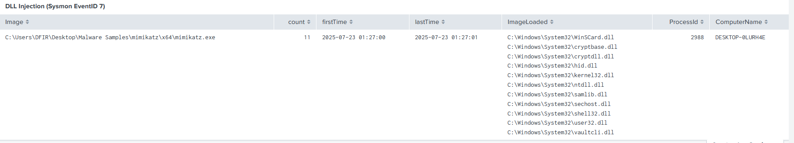  
8. **LSASS Access Panel (Sysmon Event ID 10)**  
   Mimikatz commonly accesses `lsass.exe` to extract credentials. This panel uses a **Column Chart** to visualize access attempts and which processes made them.  
   ```
   index=* sourcetype=XmlWinEventLog:Microsoft-Windows-Sysmon/Operational EventCode=10 | where match(TargetImage, "(?i)lsass.exe")  | where GrantedAccess IN ("0x1010", "0x1438", "0x1fffff")  | stats count by SourceImage
   ```
   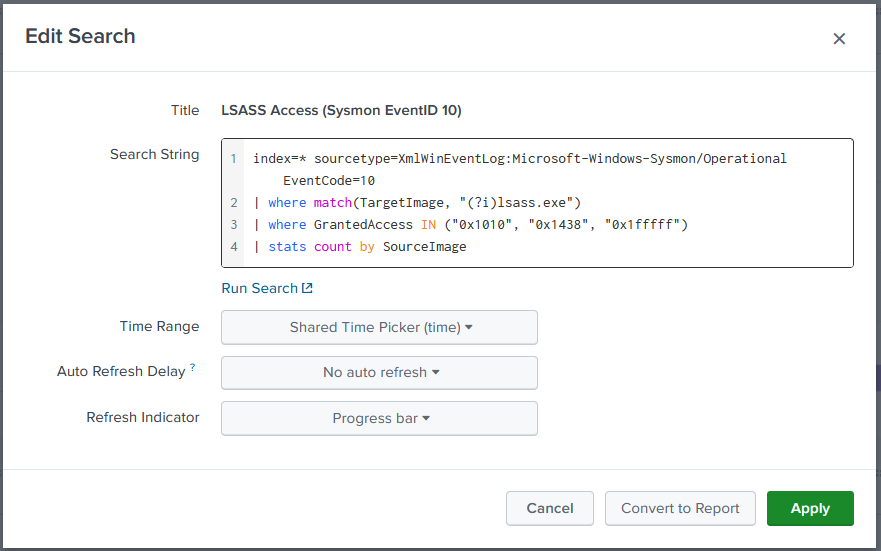  
   Mimikatz accessed **LSASS** 5 times during the simulation.  
   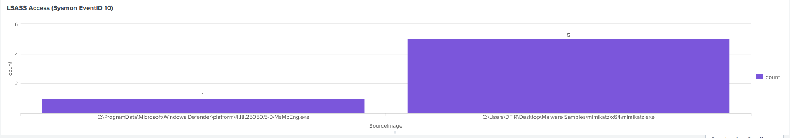  
9. **PowerShell Transcript Logs Panel**  
   This panel helps detect suspicious PowerShell commands that may not be captured by Event ID 4104.  
   ```
   index=powershell sourcetype=PowerShellTranscript | rex field=_raw "(?:>|\#)\s*(?<command>.*)" | where match(command, "(?i)mimikatz|dcsync|sekurlsa::|kerberos::|lsadump|privilege::|golden") | stats min(_time) as firstSeen max(_time) as lastSeen by command | eval firstSeen=strftime(firstSeen, "%Y-%m-%d %H:%M:%S") | eval lastSeen=strftime(lastSeen, "%Y-%m-%d %H:%M:%S")
   ```
   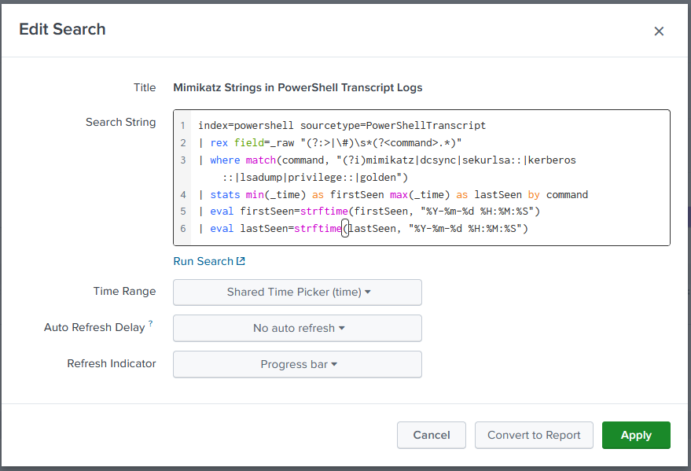  
   The PowerShell Transcript Logs also successfully detected **Mimikatz** commands.  
   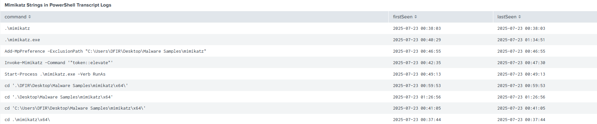  
  
### Field Extraction using Regex
Splunk may not always extract all fields automatically, so we can create manual extractions.  
I have demonstrated this in my [DNS Spoofing Analysis](https://github.com/elvanalandi/Home-Cybersecurity-Lab/tree/main/Splunk/DNS%20Spoofing%20Analysis) project. But, we use regex to extract fields from XML data.  
1. **Choose the field**  
   Select the field you want to extract, enter the Field Name, then click **Add Extraction**.  
   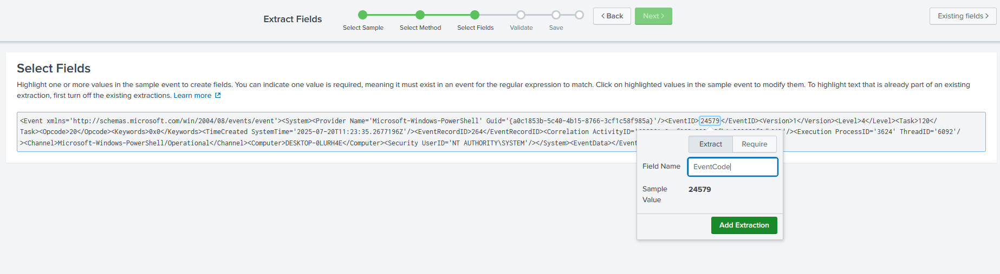  
2. **Regex**  
   Below is a sample regex for XML data. The tag **<EventCode>** contains the field value you want to extract and use for filtering. Click **Preview** to see the extraction results, and **Save** once you are satisfied.  
   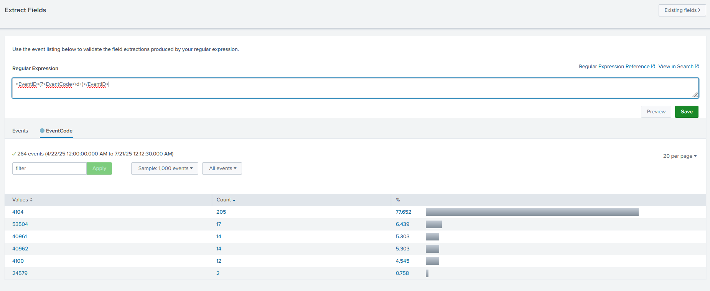  
     
### References
- [Detect Mimikatz using PowerShell Script Block Logging](https://research.splunk.com/endpoint/8148c29c-c952-11eb-9255-acde48001122/)
- [Detect Mimikatz using Loaded Images](https://research.splunk.com/deprecated/29e307ba-40af-4ab2-91b2-3c6b392bbba0/)
- [Mimikatz Detection using Windows Events](https://github.com/Th1ru-M/Windows-Threat-Hunting/blob/master/Mimikatz%20Detection)
- [Detect Pass the Hash Attack](https://blog.netwrix.com/2021/11/30/how-to-detect-pass-the-hash-attacks/)
- [Windows Security Event ID 4769](https://learn.microsoft.com/en-us/windows/security/threat-protection/auditing/event-4769)
- [MITRE ATT&CK Pass the Ticket](https://attack.mitre.org/techniques/T1550/003/)
- [Configure PowerShell logging](https://help.splunk.com/en/security-offerings/splunk-user-behavior-analytics/get-data-in/5.4.1/add-other-data-to-splunk-uba/configure-powershell-logging-to-see-powershell-anomalies-in-splunk-uba)  
- [DLL List for Mimikatz](https://www.researchgate.net/figure/DLL-list-for-Mimikatz-Compared-to-Matsuda-et-al-10_tbl3_361991727)
- [Mimikatz](https://happycamper84.medium.com/mimikatz-cheatsheet-ad2b88059b4)
