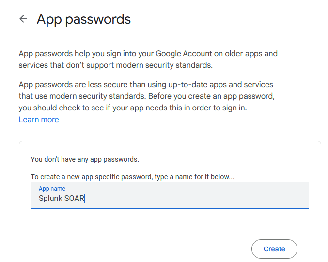
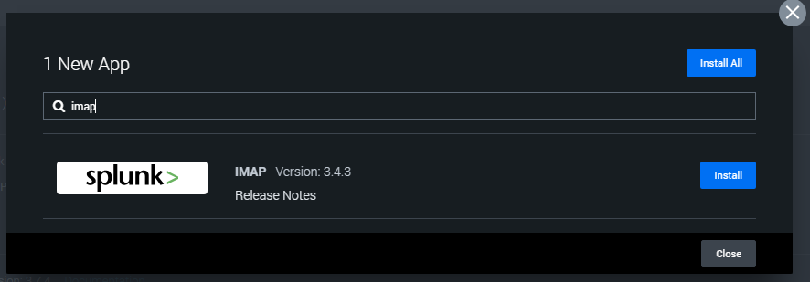
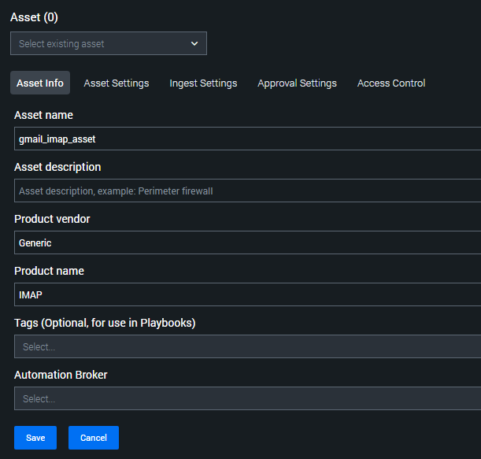
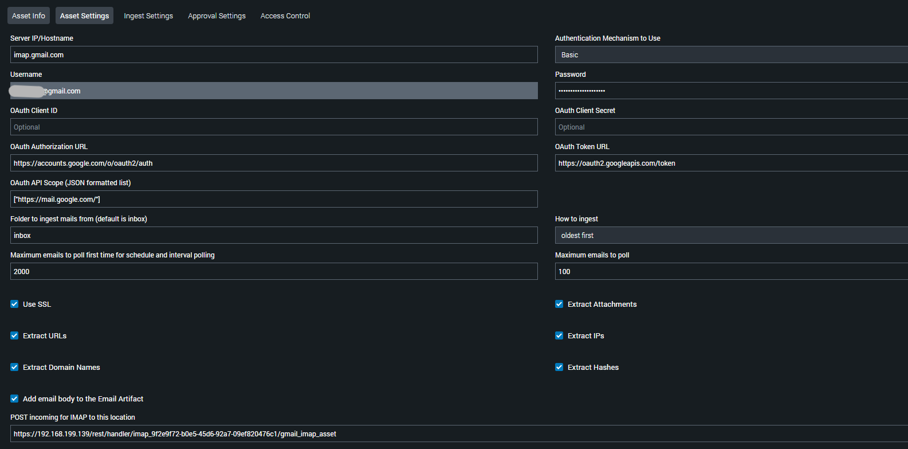
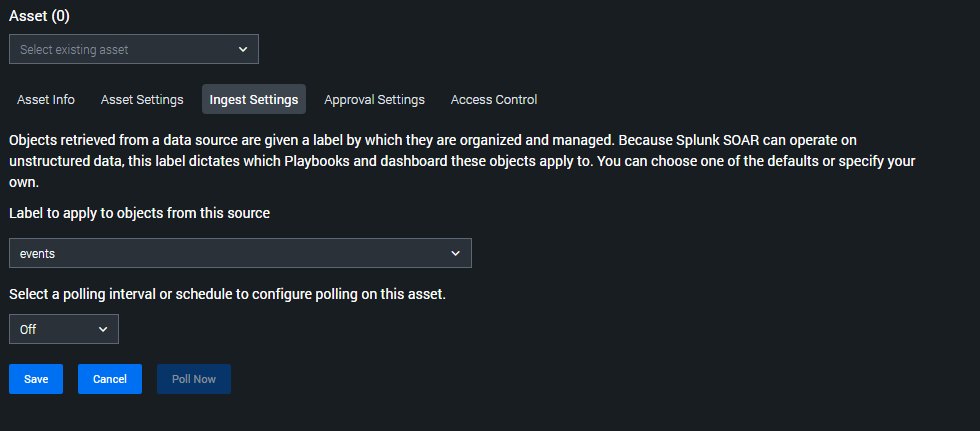
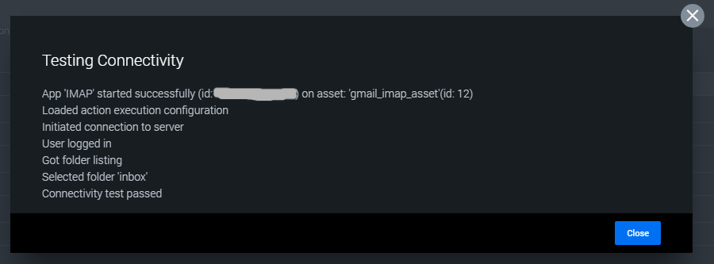
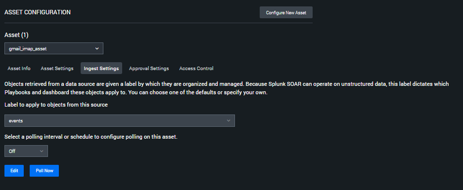
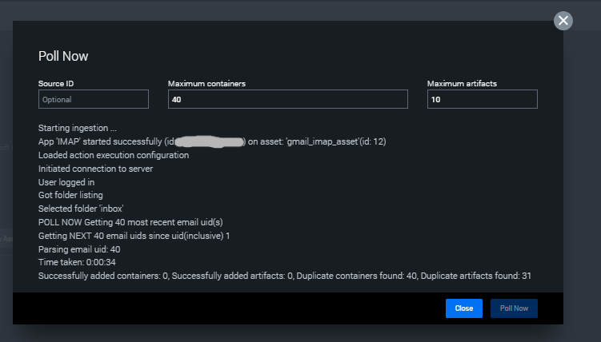

## Email Ingestion 
### Table of Contents
- [Overview](#overview)  
- [Requirements](#requirements)  
- [Gmail Email Integration Steps](#gmail-email-integration-steps)
- [IMAP Integration Steps](#imap-integration-steps) 

### Overview
This project demonstrates how to integrate Gmail Email with Splunk SOAR for automated email ingestion and analysis.  

### Requirements
- A running and accessible instance of **Splunk SOAR**
- Gmail accounts (one for the analyst and one to be monitored)

### Gmail Email Integration Steps
1. **Generate an App Password for Gmail**  
   Visit the [Gmail App Passwords page](https://myaccount.google.com/apppasswords). Create a new app name, then click the **Create** button.  
   This step must be completed for both Gmail Accounts (the analyst account and the account to be monitored).  
     
3. **Secure the App Password**  
   Be sure to store the password in a safe place, as it will be displayed only once.  

### IMAP Integration Steps  
1. **Install the IMAP App in Splunk SOAR**  
   Navigate to the **Apps** dashboard, click **New App**, search for **IMAP**, and install it.  
     
2. **IMAP Configuration**  
   Once installed, click **Configure new asset**.  
   Under the **Asset Info** section, set the **Asset name**, **Product name**, and any relevant **Tags**  
     
   Under the **Asset Settings** section, configure the following:  
   - **Server IP/Hostname**: `imap.gmail.com`  
   - **Authentication Mechanism to Use**: `Basic`  
   - **Username**: *(Your Gmail address to be monitored)*  
   - **Password**: *(The App Password that has been generated earlier)*  
   Tick all checkboxes and leave the remaining fields as default unless you have specific preferences. For example, the **How to ingest** field, you can choose **oldest first** or **newest first**.  
     
4. **Ingest Settings**  
   Specify the label for objects ingested from this source. In this case, set it to **events**.  
     
5. **Configure Approval Settings and Access Control**  
   Adjust these settings according to your preferences. It's recommended to follow the **principle of least privilege** to ensure proper access management.  
6. **Save and Test Connection**  
   After completing the configuration, click **Save**, then navigate to **Asset Settings** and run **Test Connectivity** to verify that the integration is working successfully.  
     
7. **Ingest Emails from Gmail as Events**  
   Return to the **Ingest Settings** tab. You should now see that the **Poll Now** button is clickable. Clicking this will initiate a poll to retrieve emails from the configured Gmail inbox and ingest them into Splunk SOAR as events.  
     
   A **Poll Now** popup will appear, Specify the desired values for **Maximum Containers (Events)** and **Maximum Artifacts per Container**.  
   Then, click **Poll Now** to begin the ingestion process.  
     
   
