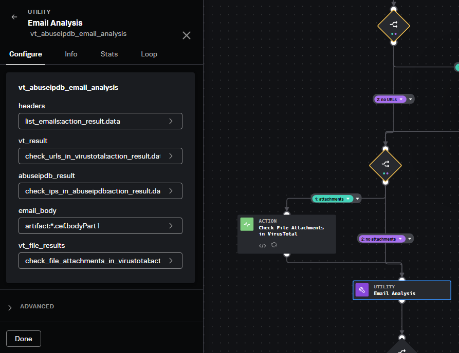
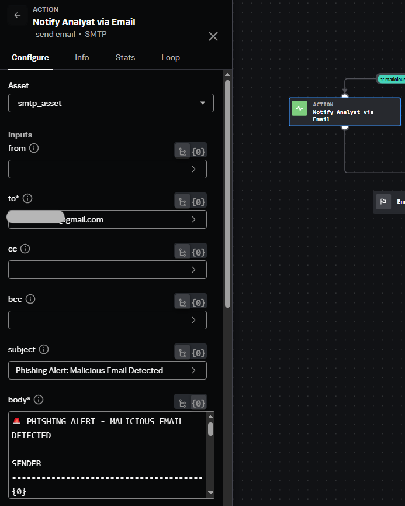

## Phishing Playbook
### Table of Contents
- [Overview](#overview)  
- [Requirements](#requirements)  
- [Phishing Playbook Implementation Walkthrough](#phishing-playbook-implementation-walkthrough)
### Overview
This project demonstrates how to develop a phishing playbook in Splunk SOAR to automate phishing response and escalation.  

### Requirements
- A running and accessible instance of **Splunk SOAR**
- A Gmail account for the analyst
- A Gmail account to be monitored

### Phishing Playbook Implementation Walkthrough
1. **Create Playbook**  
   Navigate to the SOAR **Playbooks** dashboard and click the **+ Playbook** button on the right-hand side.   
     
   Select **Automation** as the **Playbook Type**  
     
2. **IMAP Block**  
   Begin by adding an **Action** block and selecting the **get email** function from **IMAP**.  
     
   Rename the block to **List Emails** and edit the code using the Python editor on the right-hand side.  
   Specify the following parameters:
   ```
   "folder": "inbox",
   "container_id": container.get("id"),
   "search_filter": "UNSEEN",
   "ingest_email": True
   ```
     
3. **Create Custom Functions**  
   Custom functions are used in the playbook to support email analysis and IOC (Indicators of Compromise) extraction.  
   Go to the **Custom Functions** menu and click on the **+ Custom Function** button.  
   
   In this project, I will create two custom functions — one for extracting IOCs from the email, and another for performing a full analysis of the email.  
   The **extract_email_iocs** function combines the email header and body, and uses regex to extract patterns such as URLs, IP addresses, and email addresses.  
   [Extract Email IOCs Custom Function](extract_email_iocs.txt)  
   The **vt_abuse_ipdb_email_analysis** function analyses the email using data from the headers, email body, VirusTotal results, and AbuseIPDB scores.
   - It extracts the sender's email address from the `From` header.
   - It checks for suspicious keywords in the email body.
   - It reviews VirusTotal URL analysis results and generates a summary message if any are flagged as malicious.
   - It analyses any attached files using VirusTotal file reputation and summarizes the results.
   - It evaluates AbuseIPDB results, flagging IPs with an abuseConfidenceScore >= 50.
   - Finally, it builds a verdict(`malicious` or `benign`) and a reason based on all the findings.  
     
   [Email Analysis Custom Function](vt_abuseipdb_email_analysis.txt)  
4. **Extract Email IOCs Utility Block**  
   Next, add a Utility Block using the **extract_email_iocs** function. Map the headers to the **List Email** data and the body to the **CEF artifact** `bodyPart1` field.  
     
5. **IP Decision Block**   
   This Decision Block checks whether the email contains any IP addresses to analyse. If the result from the extraction is **not empty**, the playbook proceeds with IP analysis using AbuseIPDB.  
     
6. **Check IPs in AbuseIPDB Action Block**  
   Add an Action Block using the **lookup ip** action from the **AbuseIPDB** app. I added some custom code to support handling both single IP and a list of IPs.  
     
7. **URL Decision Block**  
   This block checks if at least one URL was detected in the email. If a URL is found, it proceeds to URL analysis. I unchecked the **Join settings** on the `check_ips_in_abuseipdb` block so that the playbook continues even if no IPs are detected.  
     
8. **Check URLs in VirusTotal Action Block**  
   Add an Action Block using the **url reputation** action from the **VirusTotal** app. Similar to the AbuseIPDB action block, I included custom code to support both a single URL and a list of URLs.  
     
9. **FileHash Decision Block**  
   This block checks whether the `fileHash`, `fileName`, or `vaultId` is not empty (i.e., not **None**). If any of them is present, the workflow proceeds to check the file attachment using VirusTotal.  
     
10. **Check File Attachments in VirusTotal Action Block**  
    Add an Action Block using the **file reputation** action from the **VirusTotal** app to scan the file attachment.  
      
11. **Email Analysis Utility Block**  
    This is the main component of this playbook. The email analysis function we created earlier will be applied here. I mapped the headers from IMAP, results from AbuseIPDB and VirusTotal, and the email body from the artifact as inputs to the function.  
      
12. **Verdict Decision Block**  
    Based on the result from the email analysis function, if the verdict is **malicious**, the playbook automatically proceeds to notify the analyst.  
      
13. **Email Analyst Action Block**  
    Using the SMTP app, specify the analyst's Gmail account and configure the subject and body of the email. I created a custom email body to deliver a comprehensive and informative summary, allowing the analyst to quickly escalate the issue. All details are sourced from the analysis results.  
      
    The email body includes a summary of results from VirusTotal and AbuseIPDB, the sender's email, raw message content, the final verdict, and the reasoning.  
      
    The images below show examples of the email alert sent to the analyst.  
      
      
