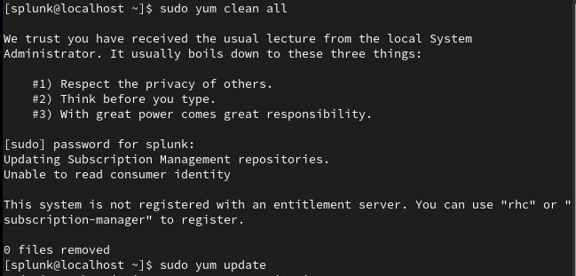
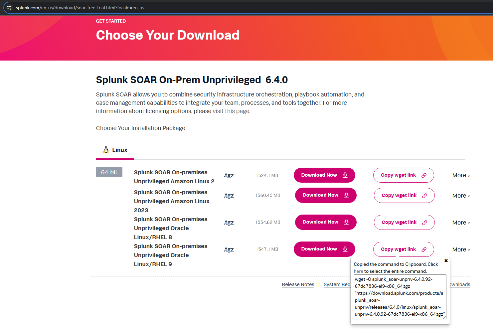
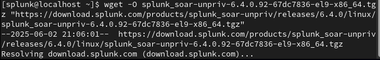
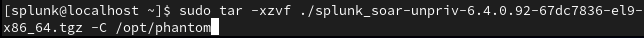
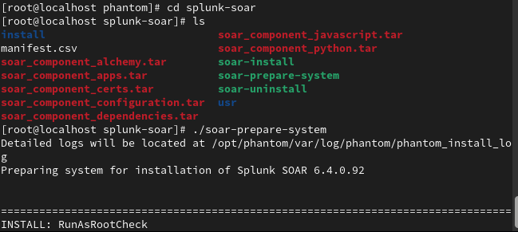
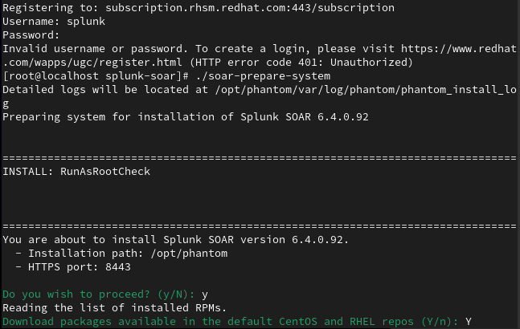
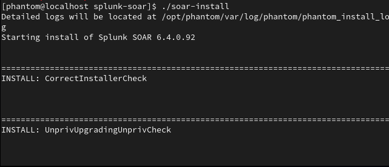
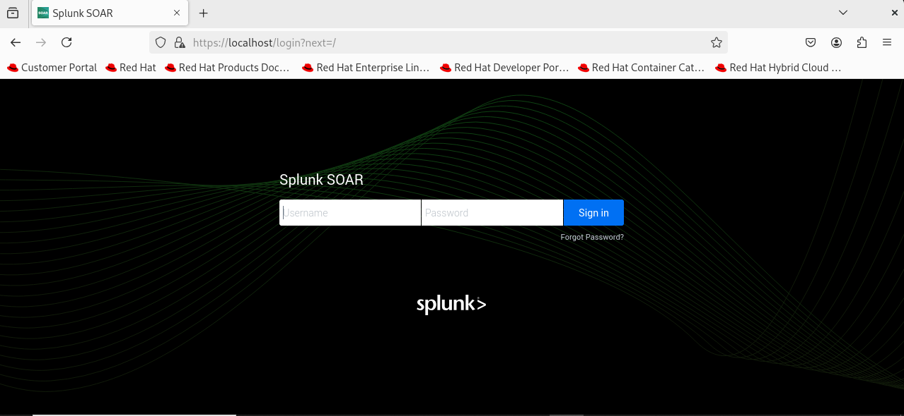
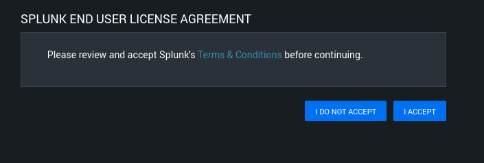

## Splunk SOAR Installation in A Virtual Machine 
### Overview
This project demonstrates how to install and deploy Splunk SOAR in a virtual machine environment.  

### Requirements
- Supported operating systems:
  - Red Hat Enterprise Linux (RHEL) 8.0 or 9.0  
  - Amazon Linux 2023  
  - Oracle Linux 8 or 9
  - Amazon Linux 2 (deprecated)
- Virtualization platform:
  - VMware Workstation, VMware Player, or VirtualBox

### Installation Steps
1. **Update the system.**
   In this example, I'm using Red Hat Enterprise Linux (RHEL) 9.6.  
   
2. **Download Splunk SOAR Packages** from the [official website](https://www.splunk.com/en_us/download/soar-free-trial.html?locale=en_us).  
   Alternatively, you can use the `wget` command to download the package directly via the terminal.    
     
     
   Here's the `wget` command to download version 6.4.1 (I chose the older version for its stability):  
   ```
   wget -O splunk_soar-unpriv-6.4.1.361-bea76553-el9-x86_64.tgz "https://download.splunk.com/products/splunk_soar-unpriv/releases/6.4.1/linux/splunk_soar-unpriv-6.4.1.361-bea76553-el9-x86_64.tgz"
   ```
3. **Unpack the packages** using `tar`.
   Replace `<version>` with the actual filename if needed:  
   ```
   tar -xzvf ./splunk_soar-unpriv-<version>.tgz -C /opt/phantom
   ```
   
4. **Navigate to the installation folder and prepare the system**.
   Run the following command:  
   ```
   ./soar-prepare-system
   ```
     
   If prompted, enter **Y** to proceed.  
     
5. **Install Splunk SOAR** by executing this command
   ```
   ./soar-install
   ```
     
6. **Access the Splunk SOAR web interface.**
   Open your web browser and login to Splunk SOAR through this URL:
   ```
   https://<ip address or hostname>:<your https port>
   ```
   The default credentials are `soar_local_admin` as the username and `password` as the password.
   It's recommended to change the password upon first login.  
     
7. Accept the Agreement to complete the setup.  
     
