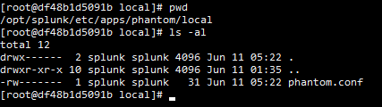
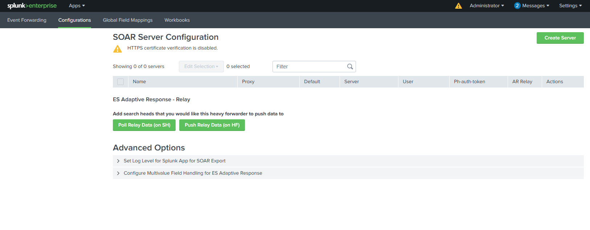
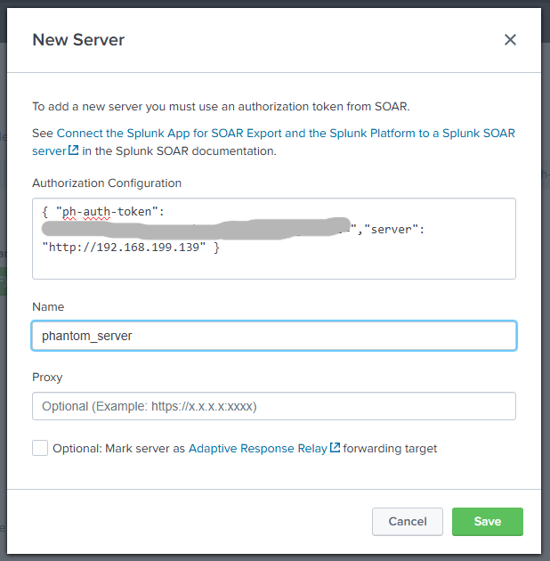

## Splunk SOAR Integration with Splunk 
### Overview
This project demonstrates how to integrate Splunk SOAR with a running Splunk instance to enable automated security incident response. By forwarding alerts from Splunk to Splunk SOAR, you can trigger automated playbooks that enrich, triage, or remediate events in real time.  

### Requirements
- A running instance of **Splunk SOAR** (already installed and accessible)
- A running instance of **Splunk Enterprise** or **Splunk Cloud**
- Network connectivity between Splunk and Splunk SOAR

### Integration Steps
1. **Install Splunk App for SOAR Export in Splunk Enterprise**
   Navigate to the **Home** page in Splunk and select **Find More Apps**.  
     
   Search for and install the **Splunk App for SOAR Export**.  
     
2. **Restart Splunk Enterprise** to enable the newly installed app.  
     
3. **Create an Automation User in Splunk SOAR**.  
   In the Splunk SOAR Dashboard, go to **Administration** > **User Management** > **Users**, and click the **+ User** button at the top right.  
   
4. **Configure the New User**.
   - Set the username to **splunk_user**.  
   - Set the user type to **Automation**.
   - Specify the **Allowed IPs** to be your **Splunk Enterprise** server's IP address (optional).
   - Click **Create**.  
     
5. **Copy the Authorization Configuration**.
   After creating the user, click on the newly created user and copy the **Authorization Configuration for REST API**.
   Save it temporarily (e.g., in Notepad).  
     
6. **Assign the Phantom Role in Splunk Enterprise**.
   In Splunk Enterprise, go to **Settings** and **Roles**, then select the **admin** role.  
     
7. **Edit the Admin Role**.
   Make sure the **phantom** role is checked to grant the necessary permissions.  
     
8. **Configure the Phantom settings (the former name of Splunk SOAR) on the Splunk Enterprise machine**.  
   Navigate to the following directory and edit the `phantom.conf` file:
   ```
   /opt/splunk/etc/apps/phantom/local
   ```
     
   Inside the file, add the following configuration to disable HTTPS certificate verification:
   ```
   [verify_certs]
   value = false
   ```
     
9. **Configure the Splunk App for SOAR Export**.  
   In **Splunk Enterprise**, open the **Splunk App for SOAR Export**.  
     
   In the **Configuration** section, click **Create Server**.  
     
   - Enter a name for the Splunk SOAR Server.  
   - Paste the **Authorization Configuration** copied earlier.  
     
     
     
   
   
