## Threat Intelligence Integration 
### Table of Contents
- [Overview](#overview)  
- [Requirements](#requirements)  
- [VirusTotal Integration Steps](#virustotal-integration-steps)
- [AbuseIPDB Integration Steps](#abuseipdb-integration-steps) 

### Overview
This project demonstrates how to integrate Threat Intelligence platform like VirusTotal and AbuseIPDB with Splunk SOAR  enrich Indicators of Compromise (IOCs) and enhance automated threat analysis and response capabilities.  

### Requirements
- A running and accessible instance of **Splunk SOAR**

### VirusTotal Integration Steps
1. **Navigate to the [VirusTotal App on Splunkbase](https://splunkbase.splunk.com/app/5865)**  
   Go to the Splunkbase website and search for *VirusTotal App*.  
   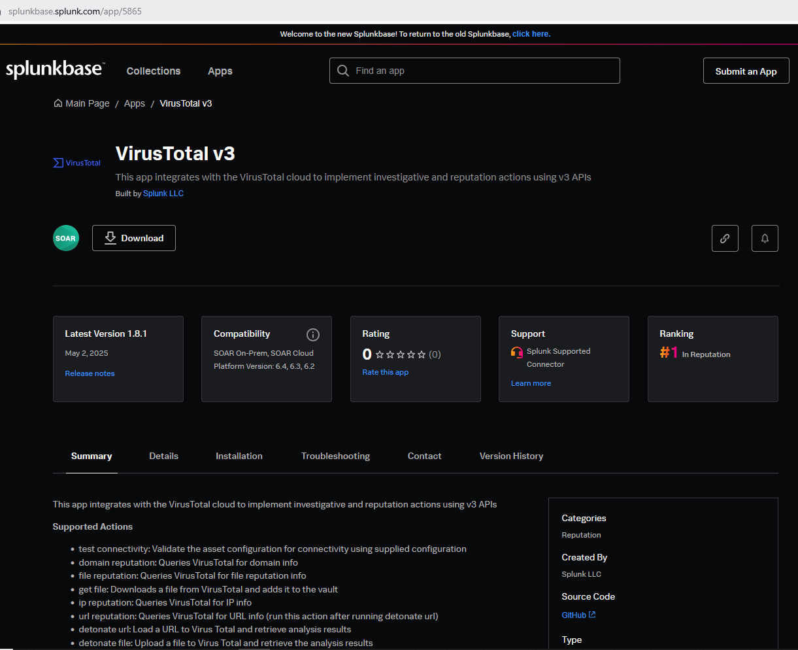  
2. **Download the App and Verify Its Integrity**  
   After downloading the file, copy the verification command provided on the Splunkbase page to validate the file's integrity.  
   - If you're using **Linux**, use the SHA256 command provided.  
     
   - If you're using **Windows**, run the `Get-FileHash` command in PowerShell and compare the resulting hash with the one shown on the Splunkbase.  
   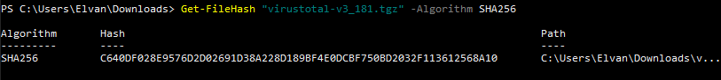
3. **Access the Apps Dashboard**  
   In the Splunk SOAR interface, navigate to the top-left menu and select **Automation** > **Apps**. Then, click **Install App** from the top-right corner.  
   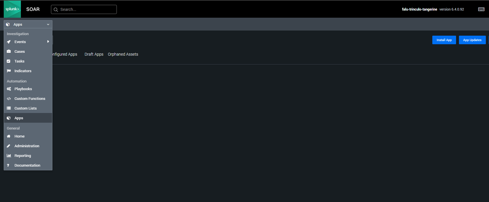  
4. **Upload the Downloaded App File**  
   Drag and drop the downloaded file into the upload area. Then, proceed with the installation.  
   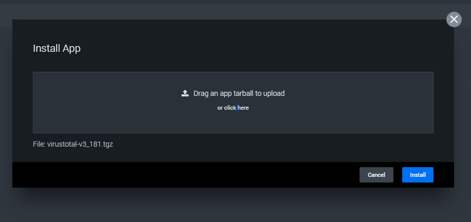  
5. **Retrieve Your VirusTotal API Key**  
   Visit the [VirusTotal website](https://www.virustotal.com/), and log in to your account. If you don't have one yet, sign up first for free.  
   Once logged in, go to your **Account** menu, select **API Key**. Copy the key and store it in a temporary location (you'll need it later).  
   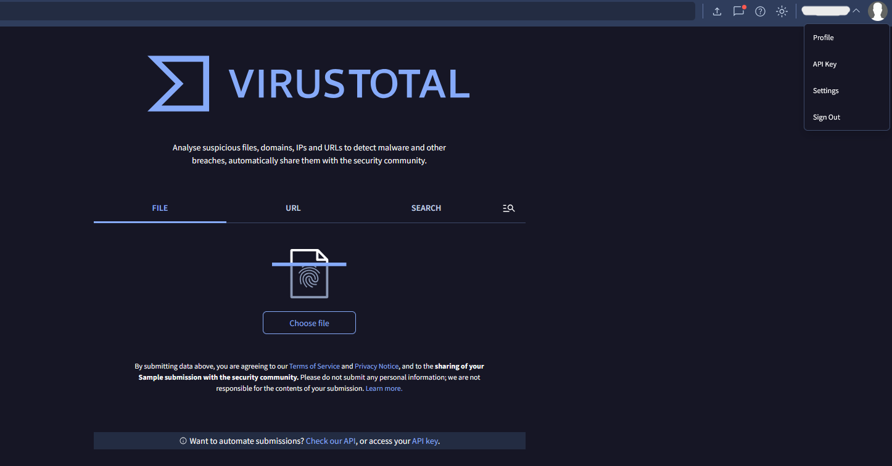  
   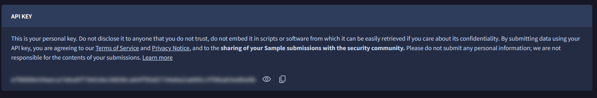  
6. **Return to the Apps Dashboard in Splunk SOAR**
   You should now see that the VirusTotal app has been successfully installed.  
   To establish a connection between **Splunk SOAR** and **VirusTotal**, click **Configure New Asset**.  
   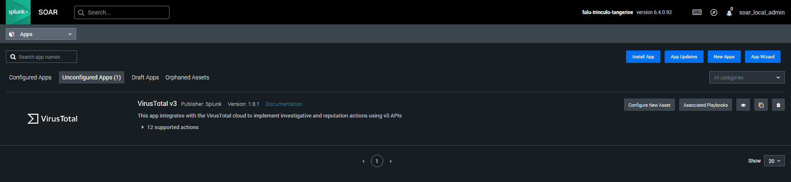  
7. **Configure VirusTotal**  
   In the **Asset Info** section, fill in the **Asset Name**, **Product Vendor**, **Product Name**, and any relevant **Tags**.  
   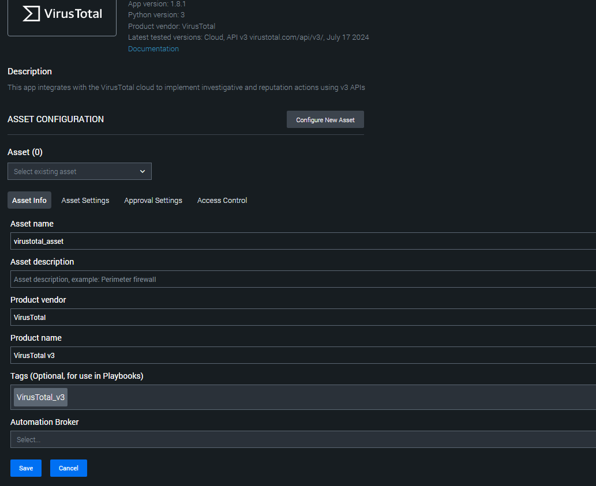  
   Next, paste the **VirusTotal API key** that you previously saved. Then, select the user account under which automated actions will be executed.  
   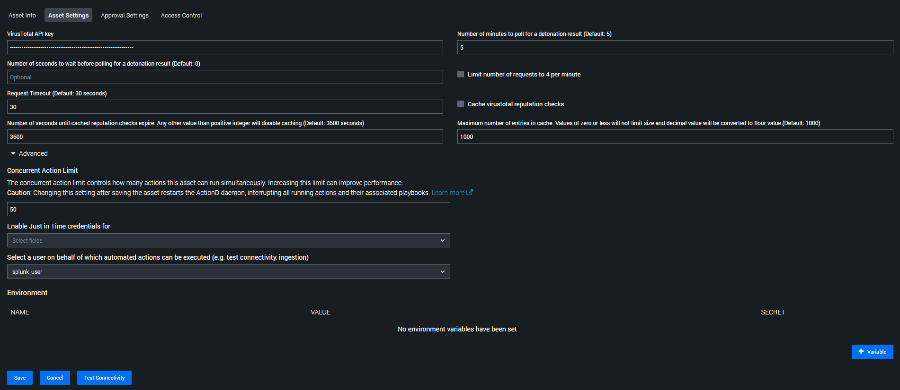  
   Configure the **Approval Settings** and **Access Control** according to your preferences.  
   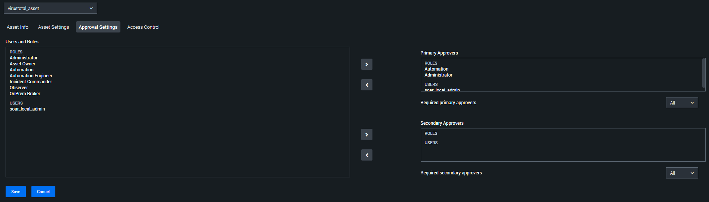  
   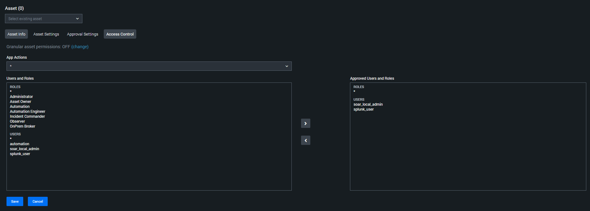  
   Finally, save the configuration and test the connection. You can test connectivity in the **Asset Settings** by clicking **Test Connectivity**.  
   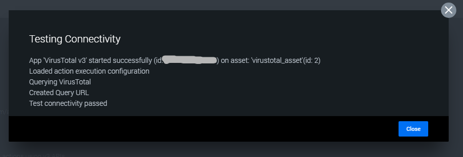  
   
### AbuseIPDB Integration Steps  
For the AbuseIPDB integration, we’ll use a different approach to install the application directly from within Splunk SOAR.  
1. **Navigate to the Apps Dashboard**  
   On the right-hand side of the Apps page, click **New Apps**. This feature allows you to automatically search for and install available apps directly within Splunk SOAR.  
   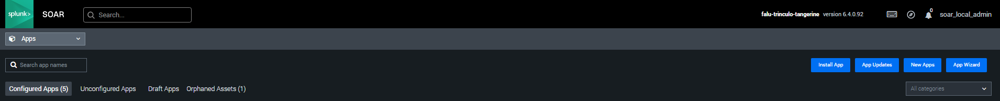  
2. **Install AbuseIPDB**
   In the search bar, type **AbuseIPDB** and click **Install** when it appears in the list.  
   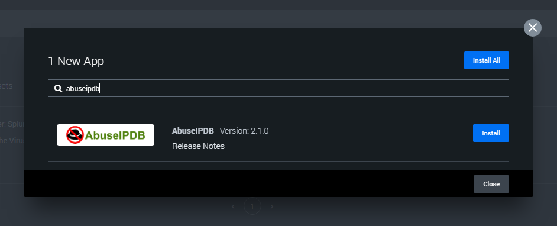  
   A login popup will appear. Sign in with your Splunk credentials.  
   - If you don’t have an account yet, create one at the [Splunk Sign-Up page](https://www.splunk.com/en_us/form/sign-up.html).  
   - Accept the terms and conditions, then proceed by clicking **Login and Install**.  
   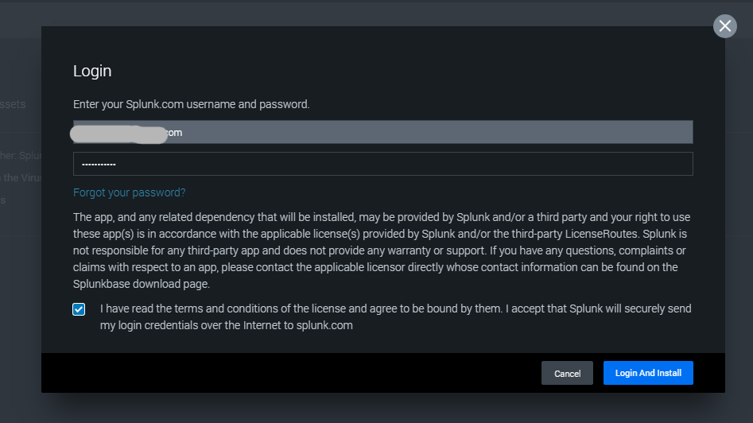  
3. **Configure AbuseIPDB**
   After installation, click **Configure New Asset** to begin setting up the integration.  
   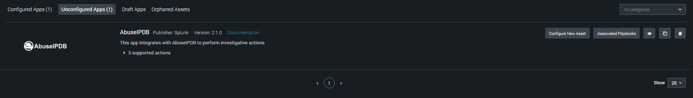  
   In the **Asset Info** section, fill in the **Asset Name**, **Product Vendor**, **Product Name**, and any relevant **Tags**.  
   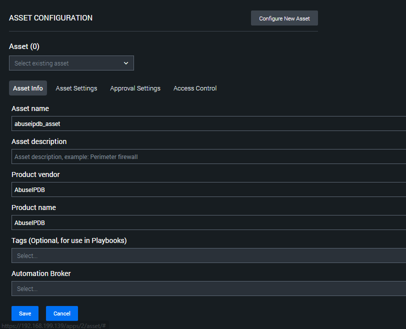  
   Next, create an account on the [AbuseIPDB Website](https://www.abuseipdb.com).  
   - After signing in, navigate to **User Account** > **API**, then click **Create Key** under the **Create API Key** section.  
   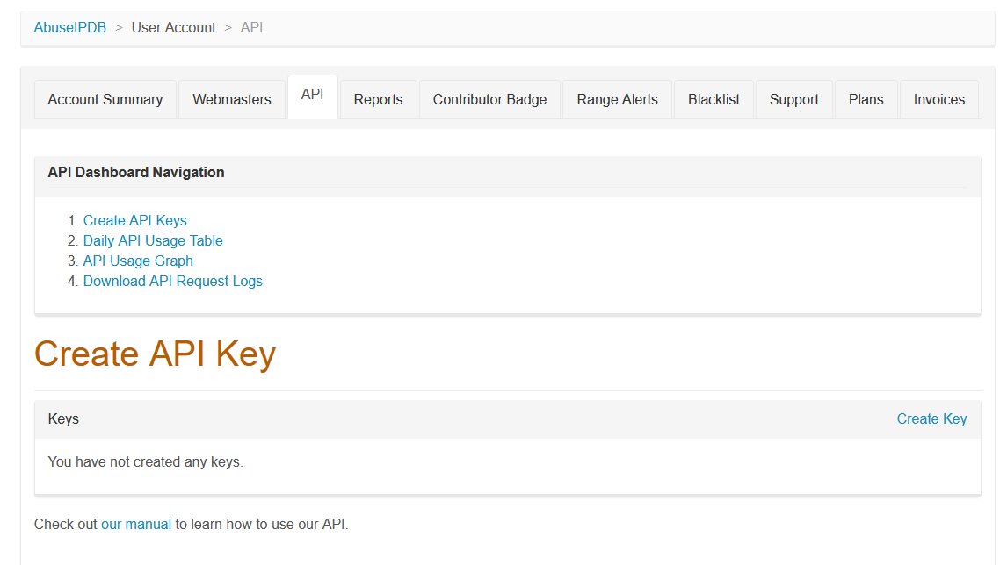  
   - Enter a name for your API key and click **Create**.  
   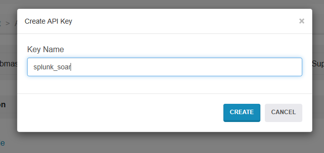  
   - Copy the generated API key.  
   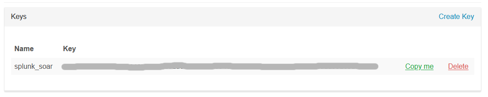  
   Return to Splunk SOAR and paste the API key into the **API Key** field. Select the user account that will run automated actions.  
   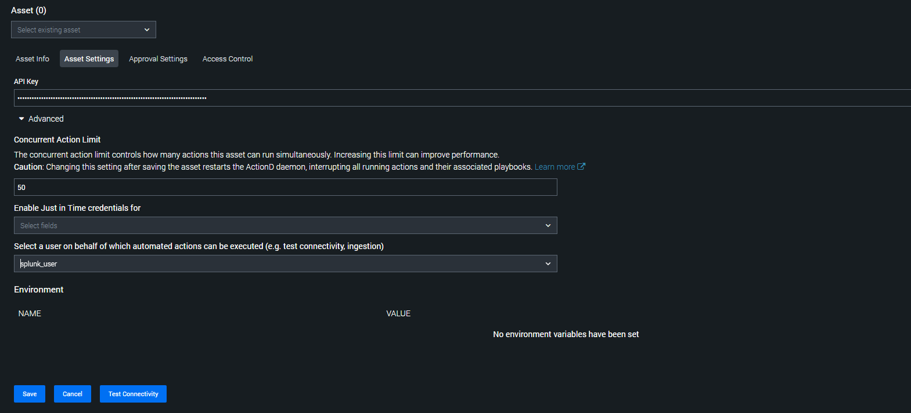  
   Configure **Approval Settings** and **Access Control**similarly to how it was done for the VirusTotal integration.  
   Lastly, test the connectivity.  A successful connection will display a message similar to the image below.  
   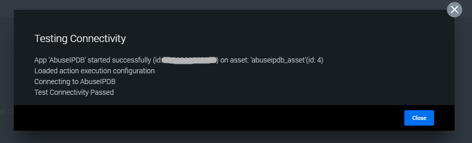  
   
   
