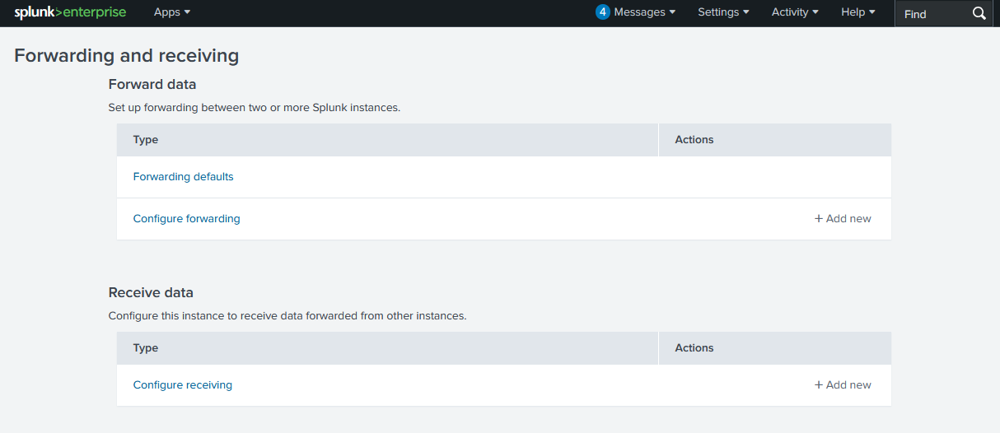
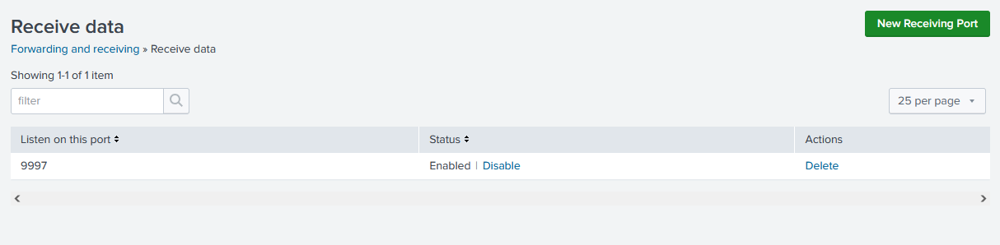
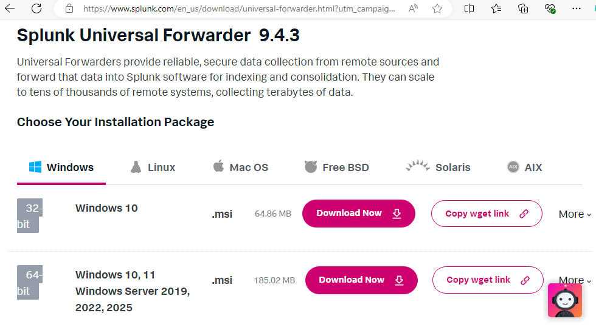
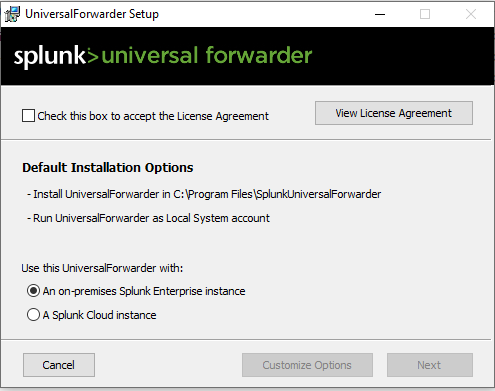
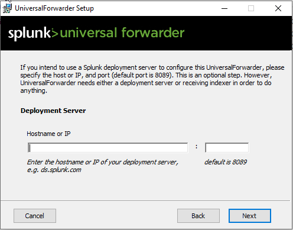
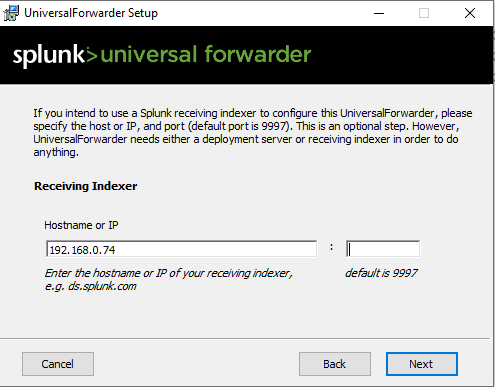

## Windows Logs Ingestion to Splunk
### Table of Contents
- [Overview](#overview)  
- [Requirements](#requirements)  
- [Prepare Splunk Server Listener](#prepare-splunk-server-listener)  
- [Install Universal Forwarder on Windows Host](#install-universal-forwarder-on-windows-host)  
  
### Overview
This project demonstrates how to ingest Windows Event Logs into Splunk Enterprise using Universal Forwarder.

### Requirements
- A Windows virtual machine (e.g., Windows 10)
- A running Splunk Enterprise instance

### Prepare Splunk Server Listener
1. **Log in to the Splunk Web Interface**  
   After powering on the Splunk server, access the Splunk Web interface at `http://<SplunkServerIP>:8000`  
2. **Configure the Receiver to listen on a specific TCP/UDP port for Universal Forwarder**  
   Navigate to **Settings** > **Forwarding and receiving** > **Configure receiving**.  
     
   Click **New Receiving Port** > enter port **9997** and click **Save**.  
   Ensure the port is **Enabled**.  
   

### Install Universal Forwarder on Windows Host
1. **Download Universal Forwarder**
   Download the latest **Windows Universal Forwarder** installer from [Splunk downloads](https://www.splunk.com/en_us/download/universal-forwarder.html).
   
2. **Run the Installer on the Windows machine**
   Accept the **License Agreement** by checking the box, then click **Next**
   
   Enter your Splunk Server IP as the **Receiving Indexer**. You can leave the **Deployment Server** field empty if you are not using a **Deployment Server** to manage your forwarders.
     
     
   Follow the prompts to complete the installation.
   
   
   
