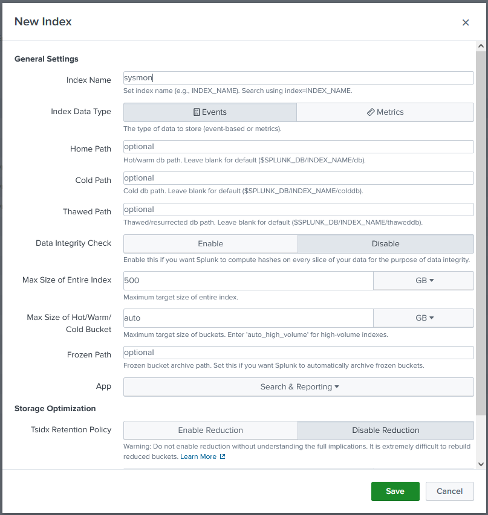

## Windows Logs Ingestion to Splunk
### Table of Contents
- [Overview](#overview)  
- [Requirements](#requirements)  
- [Prepare Splunk Server Listener](#prepare-splunk-server-listener)  
- [Install Universal Forwarder on Windows Host](#install-universal-forwarder-on-windows-host)  
- [Configure Universal Forwarder to Collect Windows Event Logs](#configure-universal-forwarder-to-collect-windows-event-logs)
- [Add Sysmon and Ingest to Splunk](#add-sysmon-and-ingest-to-splunk)
  
### Overview
This project demonstrates how to ingest Windows Event Logs and Sysmon to provides deep visibility into system behavior into Splunk Enterprise using Universal Forwarder.

### Requirements
- A Windows virtual machine (e.g., Windows 10)
- A running Splunk Enterprise instance

### Prepare Splunk Server Listener
1. **Log in to the Splunk Web Interface**  
   After powering on the Splunk server, access the Splunk Web interface at `http://<SplunkServerIP>:8000`  
2. **Configure the Receiver to listen on a specific TCP/UDP port for Universal Forwarder**  
   Navigate to **Settings** > **Forwarding and receiving** > **Configure receiving**.  
     
   Click **New Receiving Port** > enter port **9997** and click **Save**.  
   Ensure the port is **Enabled**.  
   

### Install Universal Forwarder on Windows Host
1. **Download Universal Forwarder**
   Download the latest **Windows Universal Forwarder** installer from [Splunk downloads](https://www.splunk.com/en_us/download/universal-forwarder.html).
   
2. **Run the Installer on the Windows machine**
   Accept the **License Agreement** by checking the box, then click **Next**
   
   Enter your Splunk Server IP as the **Receiving Indexer**. You can leave the **Deployment Server** field empty if you are not using a **Deployment Server** to manage your forwarders.
     
     
   Follow the prompts to complete the installation.

### Configure Universal Forwarder to Collect Windows Event Logs
1. **Locate the Universal Forwarder Folder**
   On your Windows VM, navigate to the Universal Forwarder configuration directory: `C:\Program Files\SplunkUniversalForwarder\etc\system\local`.
   
2. **Edit inputs.conf**
   Create or edit `inputs.conf` file to define which Windows Event Logs to collect.  
   You can reference configurations from the [official Splunk documentation](https://lantern.splunk.com/Security/Product_Tips/Enterprise_Security/Configuring_Windows_event_logs_for_Enterprise_Security_use).  
     
   After editing, restart the **Splunk Universal Forwarder service** service using either of the following commands in PowerShell:  
   ```
   Restart-Service splunkforwarder
   ```
   or
   ```
   splunk restart
   ```  

### Add Sysmon and Ingest to Splunk
Sysmon enhances visibility into low-level system activity and is useful for threat detection, threat hunting, and forensic investigations.  
1. **Download Sysmon**  
   Visit the official [Microsoft Sysinternals download page](https://learn.microsoft.com/en-us/sysinternals/downloads/sysmon) and download the ZIP file.  
2. **Extract Sysmon ZIP file**  
   Extract the contents to a folder of your choice.  
   
3. **Download a Sysmon Configuration File**
   Sysmon requires a configuration file (`sysmonconfig.xml`) that defines what events to monitor.  
   Download it from here:
   - [SwiftOnSecurity Sysmon Config (Github)](https://github.com/SwiftOnSecurity/sysmon-config)
     
4. **Install Sysmon with Config**
   - Open **Command Prompt** or **PowerShell** as **Administrator**.
   - Go to the Sysmon folder location.
   - Run the following command to install Sysmon with the downloaded config:
     `Sysmon64.exe -accepteula -i sysmonconfig-export.xml`
       
5. **Add Sysmon Log Collection to inputs.conf**
   Navigate again to: **Universal Forwarder** folder in `C:\Program Files\SplunkUniversalForwarder\etc\system\local`.
   Edit **inputs.conf** and add the following section:  
   ```
   [WinEventLog://Microsoft-Windows-Sysmon/Operational]
   disabled = 0
   index = sysmon
   ```
     
   Then restart the Universal Forwarder `Restart-Service splunkforwarder` or `splunk restart`.
6. **Add Indexes in Splunk**
   In Splunk Web, navigate to **Splunk Web** > **Settings** > **Indexes**.
   
   Give the **Index Name** and **Save**.  
     
   Create the `sysmon index` (and `windows` index if not already created) to match those specified in your `inputs.conf`, then click **Save**.  
   
