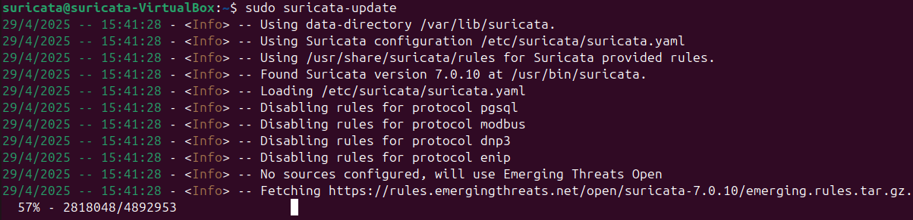
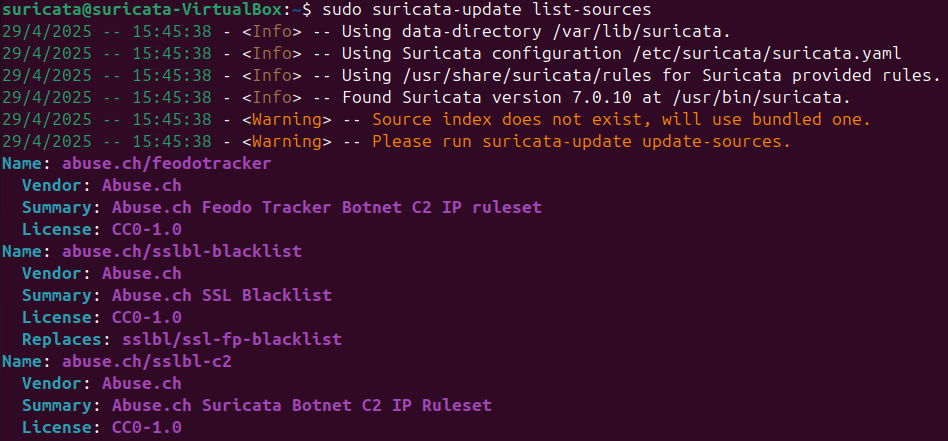
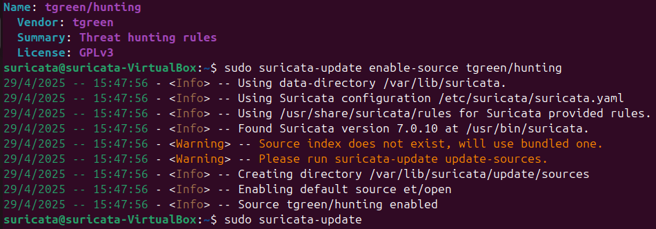
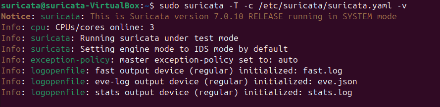
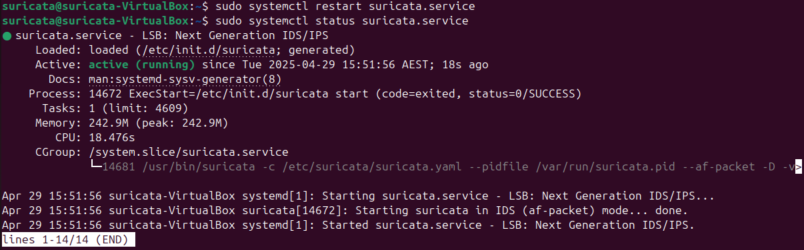
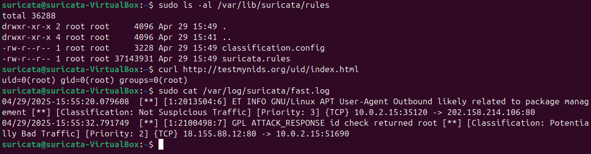
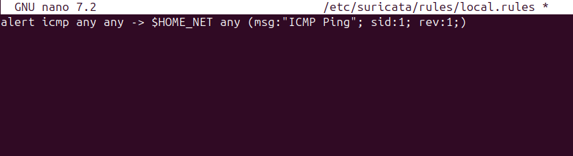
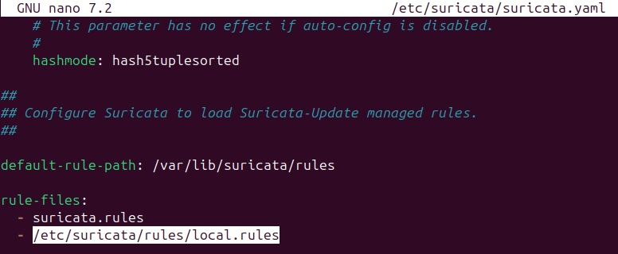
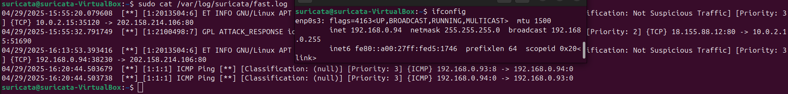
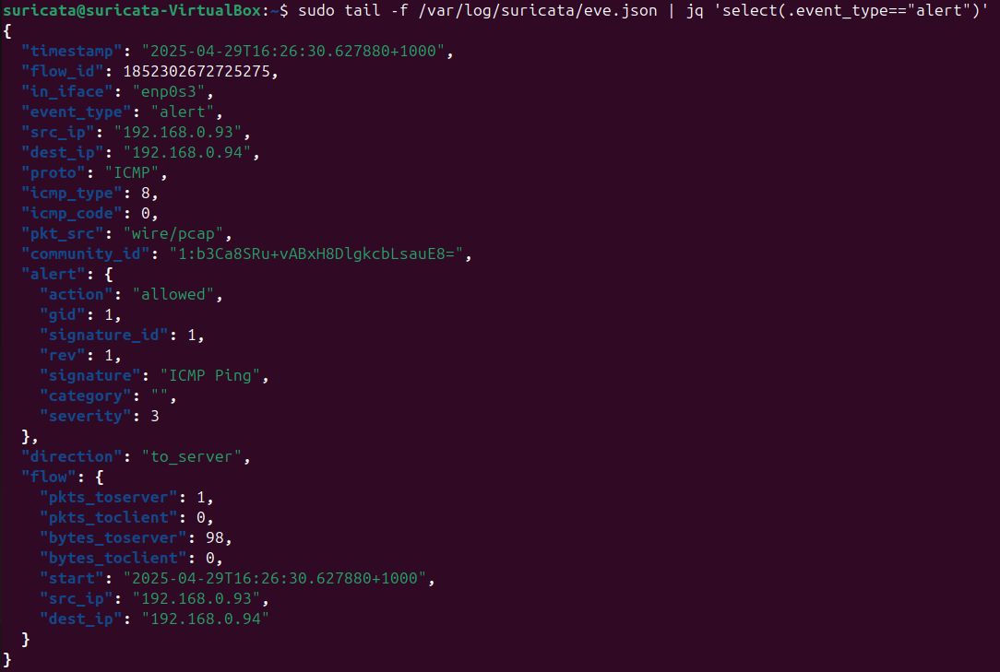

## Project Overview
This is a step-by-step guide on installing and deploying Suricata, an open-source network threat detection engine that functions as IDS/IPS (Intrusion Detection System/Intrusion Prevention System), enabling it to detect and block potential threats from entering your systems.

## Documentation
To download Suricata, first access the Suricata official website and head to the installation documentation  
You can click on this url to get into the installation page [https://docs.suricata.io/en/latest/install.html](https://docs.suricata.io/en/latest/install.html)
Then, follow these steps to install and deploy Suricata:
1. Follow the installation steps based on your operating system. Since I’m using Ubuntu, I’ll demonstrate the installation process specifically for Ubuntu.  
     
   Begin by installing the required libraries and repositories, such as `software-properties-common` and `ppa:oisf/suricata-stable`. Once added, update your packages and install Suricata.  
     
     
     
2. Enable the Suricata service and check if it’s running properly. You can skip stopping the service at this stage.  
   
3. Go to the Suricata configuration file located at **/etc/suricata/suricata.yaml** and modify the **HOME_NET** variable to match the network subnets you want Suricata to monitor.  
   
4. While editing the configuration file, ensure the correct network interface is specified under the **af-packet** and **pcap** sections so Suricata can capture network traffic. You can check your network interface by typing **ip address** or **ifconfig** command.  
     
     
5. Set the **community-id** value to **true** to correlate events across different security tools.  
     
6. Run **suricata-update** to verify and update the configuration and rule files.  
     
   This **list-sources** command is used to display all available rule sources that you can enable or download.  
     
   For instance, if you want to enable threat hunting rules from *tgreen*, you can use the `enable-source` command followed by the name of the rule source. After enabling the desired sources, update Suricata to apply the rules.  
     
7. Test the configuration using the following command to ensure everything is working properly: `sudo suricata -T -c /etc/suricata/suricata.yaml -v`.  
     
8. Restart the Suricata service.  
     
9. Test the Suricata IDS by running `curl http://testmynids.org/uid/index.html`. Then check the Suricata log file (**fast.log**). If logs appear as shown in the image below, it means the IDS is functioning correctly.  
     
10. Now, create a custom rule and save it as **local.rules** under **/etc/suricata/rules/**. This rule will detect ICMP ping requests from the internet to Suricata.  
     
11. Add the path to the new rule file in the Suricata configuration file.  
     
12. Test again using the command in step 7, then check the log files. Your new custom rule should generate a log entry after performing an ICMP ping to the Suricata host.  
     
    You can also view the logs in JSON format using the **eve.json** file along with the **jq** command for better readability.  
     
