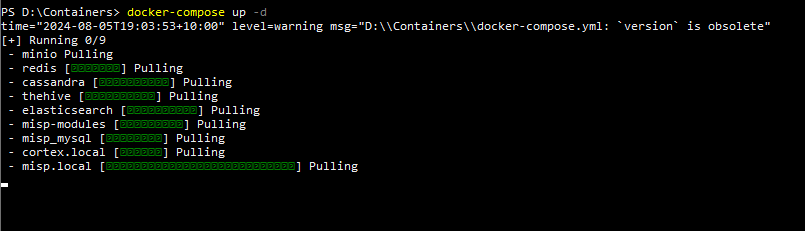
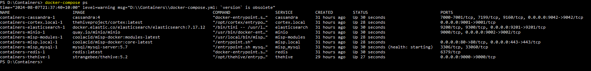

## Project Overview
This project offers a step-by-step guide for installing and integrating TheHive with Cortex and MISP, creating a comprehensive and automated incident response investigation platform.
## Documentation
There are two ways to install these three applications using docker based on my research. The first method is to download the packages individually, as outlined in this [web page](https://medium.com/@hasithaupekshitha97/simplifying-security-operations-installing-wazuh-the-hive-cortex-and-misp-using-docker-01fc4229eb73), which I am using as a reference. This guide also includes instructions for installing Wazuh. 

The second method is to create a **docker-compose** file that includes configuration settings for all the applications. I will demonstrate this approach in this project as it is very convenient.
The .yaml file can be downloaded [here](https://github.com/ls111-cybersec/thehive-cortex-misp-docker-compose-lab11update/blob/main/docker-compose.yml). I updated the Elasticsearch version to 7.17.12 and adjusted the ports to align with the Wazuh port configuration.

After creating the **docker-compose** file, you can start the Docker containers using the **docker-compose up** command. This will deploy and launch the containers for TheHive, Cortex, and MISP. 
The `-d` flag will run the containers in the background, allowing you to continue using your terminal. 
 
This process may take some time to complete. However, you can check if the services are running by using the **docker-compose ps** command, as shown in the image below. 

