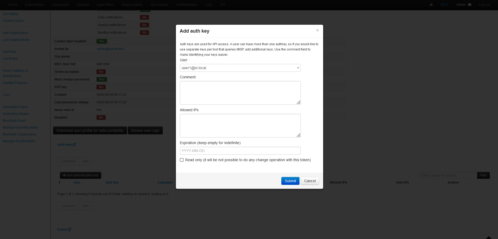

## Project Overview
This project offers a step-by-step guide for installing and integrating TheHive with Cortex and MISP, creating a comprehensive and automated incident response investigation platform.
## Documentation
There are two ways to install these three applications using docker based on my research. The first method is to download the packages individually, as outlined in this [web page](https://medium.com/@hasithaupekshitha97/simplifying-security-operations-installing-wazuh-the-hive-cortex-and-misp-using-docker-01fc4229eb73), which I am using as a reference. This guide also includes instructions for installing Wazuh.  

The second method is to create a **docker-compose** file that includes configuration settings for all the applications. I will demonstrate this approach in this project as it is very convenient.
The .yaml file can be downloaded [here](https://github.com/ls111-cybersec/thehive-cortex-misp-docker-compose-lab11update/blob/main/docker-compose.yml). I updated the Elasticsearch version to 7.17.12 and adjusted the ports to align with the Wazuh port configuration.

After creating the **docker-compose** file, you can start the Docker containers using the **docker-compose up** command. This will deploy and launch the containers for TheHive, Cortex, and MISP.  
The `-d` flag will run the containers in the background, allowing you to continue using your terminal.  
  
This process may take some time to complete. However, you can check if the services are running by using the **docker-compose ps** command, as shown in the image below.  
  
  
Next, integrate all the applications into a comprehensive incident response system.  

### MISP
MISP can be accessed from **https:/localhost** using the web browser. The default login credentials are:  
**Email**: admin@admin.test  
**Password**: admin  
  
Once logged in, create a new password to enhance the security of MISP.  
  
After changing the password, you will be navigated to the "My Profile" section, where you can view the admin information.  
  
Now, set up the organisation. To do this, access the "Add Organisation" section from the **Administration** menu in the navigation bar and select **Add Organisations**.  
  
Then, add the organisation details according to your preference. The **Organisation Identifier** and **UUID** are mandatory. For the UUID, you need to click the **Generate UUID** button first to generate a unique identifier.  
  
The result can be seen in the "View Organisation" section.  
The next step is to add a new user to the new organisation. Go to the **Administration** menu again and select **Add User**.  
  
In this section, the important fields are **Email, Password, Organisation,** and **Role**. Make sure to assign the organisation you have previously set up and choose the appropriate role for the user. The role you select will impact the user's permissions in the system. The **Org Admin** role has more restriction compared to the **Admin** role. To create the user, click on the **Create user** button.  
  
Go to the "List Users" section to verify if the user has been created. Then, view the user's details by clicking on the eye icon located on the right side of the user's row.  

Move to the next step, add the authentication key that will be used to establish the connection with TheHive. Click on **Add authentication key** under the **Auth keys** to start creating the key.  
  
You can optionally add a comment, specify allowed IPs to restrict the connection to intended IPs, and set an expiration date, though these are not mandatory from the message box. Click **Submit** to finish the key setup.  
  
Make sure to note down the key somewhere safe, as it will not be possible to view the full authentication key again.  
 
The middle characters of the key will be censored, as shown in the image below.  
  
  
After setting up the authentication key, the next step is to set up Cortex.  

### Cortex
You can access Cortex through port **9001** on **localhost**. When you first visit the Cortex page, it will look like the image below.  
  
