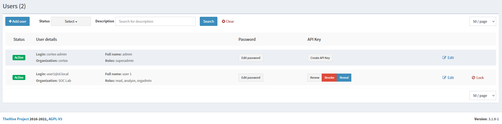

## Project Overview
This project offers a step-by-step guide for installing and integrating TheHive with Cortex and MISP, creating a comprehensive and automated incident response investigation platform.
## Documentation
There are two ways to install these three applications using docker based on my research. The first method is to download the packages individually, as outlined in this [web page](https://medium.com/@hasithaupekshitha97/simplifying-security-operations-installing-wazuh-the-hive-cortex-and-misp-using-docker-01fc4229eb73), which I am using as a reference. This guide also includes instructions for installing Wazuh.  

The second method is to create a **docker-compose** file that includes configuration settings for all the applications. I will demonstrate this approach in this project as it is very convenient.
The .yaml file can be downloaded [here](https://github.com/ls111-cybersec/thehive-cortex-misp-docker-compose-lab11update/blob/main/docker-compose.yml). I updated the Elasticsearch version to 7.17.12 and adjusted the ports to align with the Wazuh port configuration.

After creating the **docker-compose** file, you can start the Docker containers using the **docker-compose up** command. This will deploy and launch the containers for TheHive, Cortex, and MISP.  
The `-d` flag will run the containers in the background, allowing you to continue using your terminal.  
  
This process may take some time to complete. However, you can check if the services are running by using the **docker-compose ps** command, as shown in the image below.  
  
  
Next, integrate all the applications into a comprehensive incident response system.  

### MISP
MISP can be accessed from **https:/localhost** using the web browser. The default login credentials are:  
**Email**: admin@admin.test  
**Password**: admin  
  
Once logged in, create a new password to enhance the security of MISP.  
  
After changing the password, you will be navigated to the "My Profile" section, where you can view the admin information.  
  
Now, set up the organisation. To do this, access the "Add Organisation" section from the **Administration** menu in the navigation bar and select **Add Organisations**.  
  
Then, add the organisation details according to your preference. The **Organisation Identifier** and **UUID** are mandatory. For the UUID, you need to click the **Generate UUID** button first to generate a unique identifier.  
  
The result can be seen in the "View Organisation" section.  
The next step is to add a new user to the new organisation. Go to the **Administration** menu again and select **Add User**.  
  
In this section, the important fields are **Email, Password, Organisation,** and **Role**. Make sure to assign the organisation you have previously set up and choose the appropriate role for the user. The role you select will impact the user's permissions in the system. The **Org Admin** role has more restriction compared to the **Admin** role. To create the user, click on the **Create user** button.  
  
Go to the "List Users" section to verify if the user has been created. Then, view the user's details by clicking on the eye icon located on the right side of the user's row.  

Move to the next step, add the authentication key that will be used to establish the connection with TheHive. Click on **Add authentication key** under the **Auth keys** to start creating the key.  
  
You can optionally add a comment, specify allowed IPs to restrict the connection to intended IPs, and set an expiration date, though these are not mandatory from the message box. Click **Submit** to finish the key setup.  
  
Make sure to note down the key somewhere safe, as it will not be possible to view the full authentication key again.  
 
The middle characters of the key will be censored, as shown in the image below.  
  
  
After setting up the authentication key, the next step is to set up Cortex.  

### Cortex
You can access Cortex through port **9001** on **localhost**. When you first visit the Cortex page, it will look like the image below. After clicking the "Update Database" button, enter the administrator account login credentials and name.  
  
  
Next, you'll see the users page displaying the details of the users that have been created.  
  
For now, let’s skip the user settings. Go to the "Organisation" menu on the top bar to add a new organization and click the **Add organisation** button to create a new organisation. Then, enter the organisation’s name and description.  
  
  
The result of adding the organization will look like the image below.  
  
Now, go back to the Users Dashboard to add a new user. It’s safer to create a new user instead of using the admin account, which has full permissions and could pose a risk.  
  
Click **Add user** and fill in the required details. Be careful when selecting the **Roles** for the user, as different roles come with varying levels of access and can impact system security.  
  
  
Since the new user doesn’t have a password by default, set one by clicking the **New Password** button. After setting the password, press **Enter** on your keyboard to save it.  
  
Finally, create an API key for the new user by clicking **Create API Key**. This key is essential for connecting to TheHive. Click on **Reveal** to view the API key, and make sure to save it somewhere secure.  
  
  

### TheHive Integration
The last step is to integrate everything with TheHive.  
TheHive can be accessed on port **9000**. The default login credentials are:  
**Login**: admin  
**Password**: secret  
  
Once logged in, you'll notice the Cortex and MISP logos in the bottom left corner. They will either have a red border (indicating a connection issue) or a grey border (indicating no connection). Therefore, we need to setup the connection first.  
  
Create a conf folder inside the thehive directory within the container's folder. This will be used to store connector configuration files for TheHive. Then, make a file named "application.conf" under conf folder.  
  
Copy and paste the following code into the configuration file, and be sure to replace <MISP API Key> with your own <MISP API Key> and <Organisation Name> with the name of your organization:  
```play.module.enabled += org.thp.thehive.connector.misp.MispModule
misp {
	interval: 1 hour
	servers: [
		{
			name = "MISP"
			url = "https://misp.local"
			auth {
				type = key
				key = "<MISP API Key>"
			}
			tags = ["tag1", "tag2", "tag3"]
			caseTemplate = "misp"
			includedTheHiveOrganisations = ["<Organisation Name>"]
		}
	]
}  
```
  
Also, configure TheHive with the Cortex port, set the Cortex API keys, and specify the path for the **application.conf** file in the **docker-compose** file. I am using port **9003** since port **9002** is already in use.  
  
To apply the configuration changes, you can either turn down the containers and start them again, or use the `docker-compose restart`command to restart them directly.  
   
 Next, go to **Platform Management**in the sidebar. You'll see that the logos' borders on the bottom left change color (Cortex turns yellow and MISP turns red). After that, go to the Cortex dashboard from the top navigation bar.  
  
Click on the server name (in my case, **cortex0**) and enter the Cortex API Key that you saved earlier. Make sure to disable **Check Certificate Authority** because we are using a self-signed SSL certificate. To apply the settings, first click **Test server connection**, then click **Update**.  
  
The Cortex logo border color should be green, indicating that the connection has been successfully established.  
  
Now, go to the MISP dashboard from the top navigation bar. Click on the server name, enter the MISP server URL (**https://misp.local**), the MISP API Key, and disable the **Check Certificate Authority**option. Then, test the connection and click **Update**.  
  
They are should be green by now.  
  
For TheHive Management, you need to create a new organisation and a new user. To do this, go to the **Organisation Management** dashboard, indicated by a house logo on the top left. Click on the **+** button to add a new organisation. Enter the name and description for the new organisation.  
  
  
User Management, indicated by a people logo under the Organisation logo, is where you can add a new user. Click on the **+** button to create a new user. Enter the login email and the user's name, and make sure to assign the user to the newly created organisation. I set the user's role as **org-admin**.  
  
  
  
The table below is the permission based on the user's role. For more detailed information, see the documentation of TheHive User Guide [here](https://docs.strangebee.com/cortex/user-guides/roles/).  
  
The default password is not set, so you'll need to create one using the **Preview** link, which you can access by hovering your mouse over the right side of the user name. Under the **Password** section, there should be a **Create Password** link. In the image below, this link does not appear because a password has already been set.  
  
If everything is set up, it's ready to be used.  
The two images below illustrate the dashboard differences between a standard user and an admin. To see these differences, log out of the admin account and log in as a user through the logout button.  
   

### References
[1] https://docs.strangebee.com/thehive/installation/docker/docker/  
[2] https://github.com/ls111-cybersec/thehive-cortex-misp-docker-compose-lab11update/blob/main/docker-compose.yml  
[3] https://medium.com/@hasithaupekshitha97/simplifying-security-operations-installing-wazuh-the-hive-cortex-and-misp-using-docker-01fc4229eb73  
[4] https://docs.strangebee.com/cortex/user-guides/roles/  
