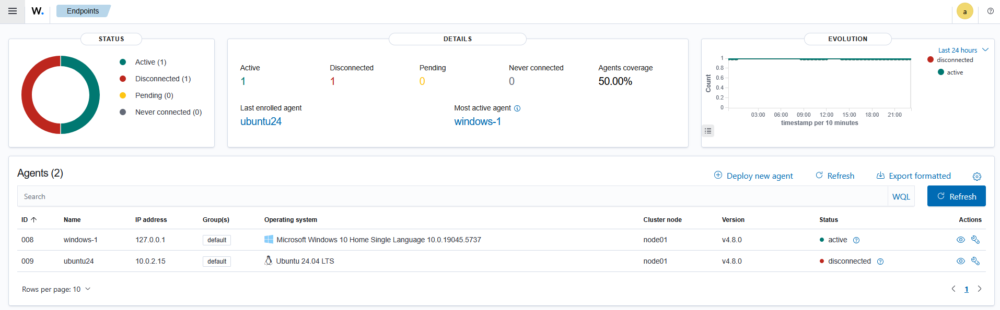

## Project Overview
This project provides a step-by-step guide for integrating Wazuh with Suricata to create a comprehensive Intrusion Detection and Prevention System (IDS/IPS).  

## Documentation
### Pre-Requisites:  
- Suricata installed (If not yet installed, follow this guide: [Suricata Installation and Configuration](https://github.com/elvanalandi/Home-Cybersecurity-Lab/tree/main/Suricata/Suricata%20Installation%20and%20Configuration)  
- A running Wazuh server  

### Integration Steps:   
1. To connect Suricata to Wazuh, you first need to install the Wazuh agent on the Suricata machine. Start by navigating to the Wazuh dashboard and go to: **Wazuh menu -> Server management -> Endpoints Summary**.  
     
2. In the **Endpoints Dashboard**, click on **Deploy new agent** located in the center of the page.  
   
3. Select the operating system of the Suricata machine, specify the Wazuh server address, and assign a name to the Suricata agent.
     
4. Copy the generated installation commands to your clipboard—these will be run on the Suricata machine.  
     
5. On the Suricata machine, paste and execute the full set of deployment commands.  
   
6. Return to the Wazuh Endpoints dashboard. You should now see the connected Suricata agent listed.  
     
7. On the Suricata machine, edit the **ossec.conf** file located at `/var/ossec/etc/ossec.conf`, and add a new localfile entry to point to the Suricata JSON log file:
   ```
   <ossec_config>
     <localfile>
      <log_format>json</log_format>
      <location>/var/log/suricata/eve.json</location>
    </localfile>
   </ossec_config>
   ```
  Also ensure similar configuration is applied on the Wazuh Manager.  
    
    
8. To verify that Suricata logs are being ingested, go to the **Threat Hunting** menu pointed to the Suricata machine in Wazuh, click **Add filter**, choose **rule.groups**, set the Operator to **is**, and type **suricata** as the value. You should now see Suricata alerts, as shown in the image below.  
    
    
For detailed information on the integration, refer to the official [Wazuh documentation](https://documentation.wazuh.com/current/proof-of-concept-guide/integrate-network-ids-suricata.html)
