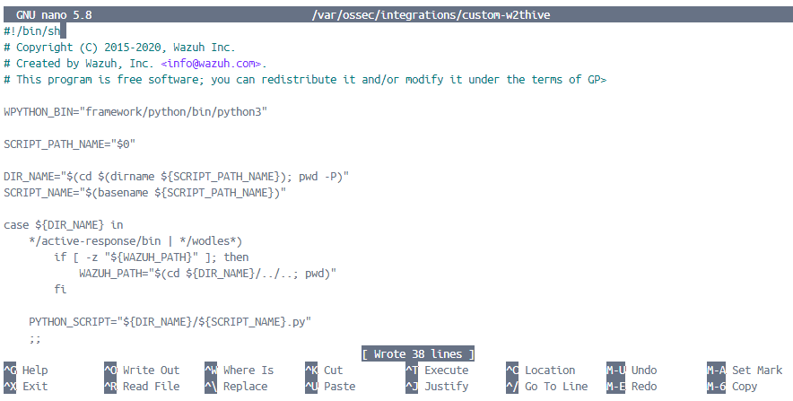
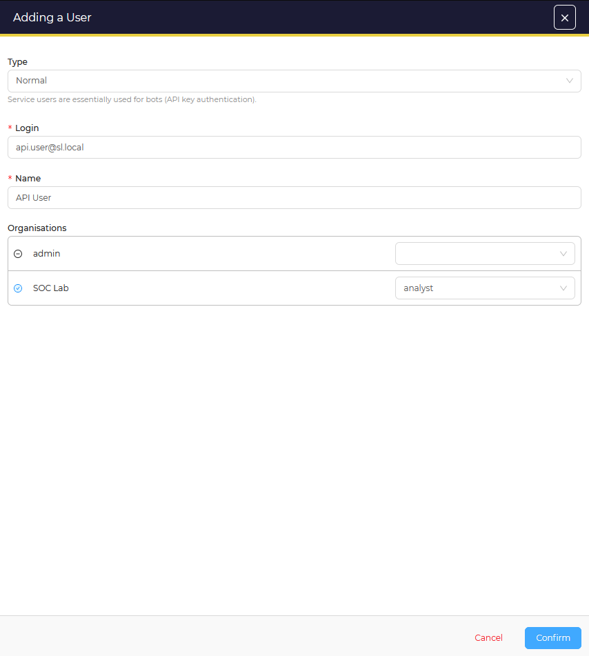
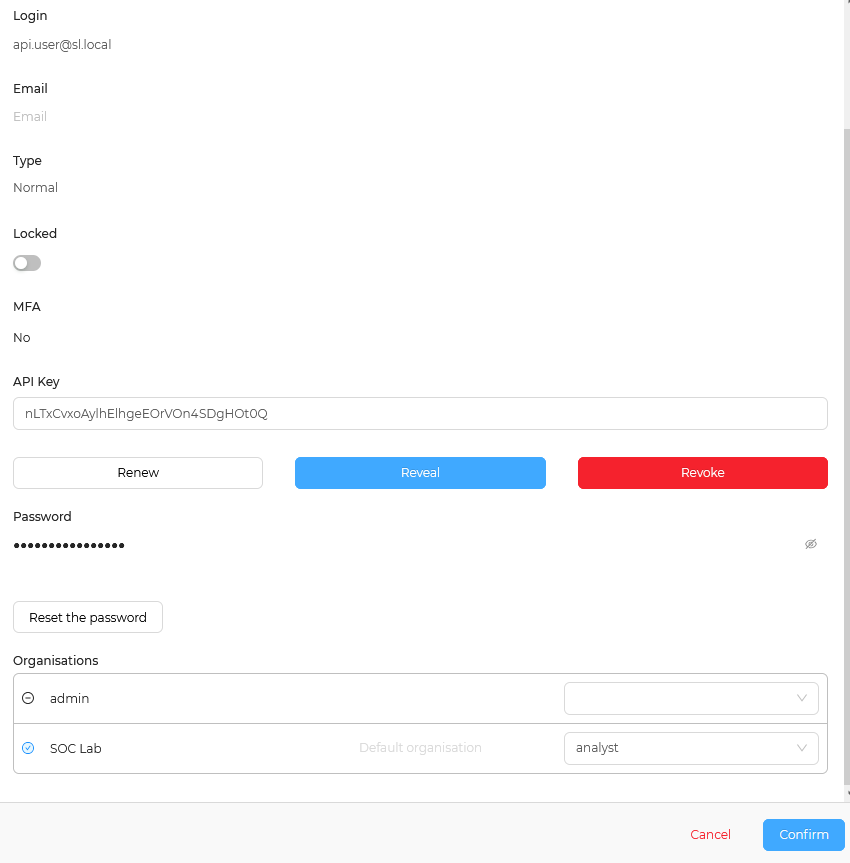

## Project Overview
This project is a step-by-step guide for integrating Wazuh with TheHive, enabling a comprehensive and automated incident response investigation platform.  

## Documentation
### Pre-Requisites:  
- pip library installed on the Wazuh manager server.
- Python installed in Wazuh manager server.
- TheHive server
- Wazuh server

### Integration Steps:    
1. On the Wazuh manager server, install the thehive4py Python module using the following command:
   `sudo /var/ossec/framework/python/bin/pip3 install thehive4py==1.8.1`  
     
2. Create an integration script in the OSSEC integrations folder at `/var/ossec/integrations/custom-w2thive.py`. You can adjust the threshold level (lvl_threshold) to ensure only relevant alerts are forwarded to TheHive. 
   You can create the script using **nano**, as shown in the image below, or with any other text editor.  
     
   The Python script for the integration can be copied from the following code:  
```py
#!/var/ossec/framework/python/bin/python3
import json
import sys
import os
import re
import logging
import uuid
from thehive4py.api import TheHiveApi
from thehive4py.models import Alert, AlertArtifact

#start user config

# Global vars

#threshold for wazuh rules level
lvl_threshold=0
#threshold for suricata rules level
suricata_lvl_threshold=3

debug_enabled = False
#info about created alert
info_enabled = True

#end user config

# Set paths
pwd = os.path.dirname(os.path.dirname(os.path.realpath(__file__)))
log_file = '{0}/logs/integrations.log'.format(pwd)
logger = logging.getLogger(__name__)
#set logging level
logger.setLevel(logging.WARNING)
if info_enabled:
logger.setLevel(logging.INFO)
if debug_enabled:
logger.setLevel(logging.DEBUG)
# create the logging file handler
fh = logging.FileHandler(log_file)
formatter = logging.Formatter('%(asctime)s - %(name)s - %(levelname)s - %(message)s')
fh.setFormatter(formatter)
logger.addHandler(fh)


def main(args):
logger.debug('#start main')
logger.debug('#get alert file location')
alert_file_location = args[1]
logger.debug('#get TheHive url')
thive = args[3]
logger.debug('#get TheHive api key')
thive_api_key = args[2]
thive_api = TheHiveApi(thive, thive_api_key )
logger.debug('#open alert file')
w_alert = json.load(open(alert_file_location))
logger.debug('#alert data')
logger.debug(str(w_alert))
logger.debug('#gen json to dot-key-text')
alt = pr(w_alert,'',[])
logger.debug('#formatting description')
format_alt = md_format(alt)
logger.debug('#search artifacts')
artifacts_dict = artifact_detect(format_alt)
alert = generate_alert(format_alt, artifacts_dict, w_alert)
logger.debug('#threshold filtering')
if w_alert['rule']['groups']==['ids','suricata']:
#checking the existence of the data.alert.severity field
if 'data' in w_alert.keys():
if 'alert' in w_alert['data']:
#checking the level of the source event
if int(w_alert['data']['alert']['severity'])<=suricata_lvl_threshold:
send_alert(alert, thive_api)
elif int(w_alert['rule']['level'])>=lvl_threshold:
#if the event is different from suricata AND suricata-event-type: alert check lvl_threshold
send_alert(alert, thive_api)


def pr(data,prefix, alt):
for key,value in data.items():
if hasattr(value,'keys'):
pr(value,prefix+'.'+str(key),alt=alt)
else:
alt.append((prefix+'.'+str(key)+'|||'+str(value)))
return alt


def md_format(alt,format_alt=''):
md_title_dict = {}
#sorted with first key
for now in alt:
now = now[1:]
#fix first key last symbol
dot = now.split('|||')[0].find('.')
if dot==-1:
md_title_dict[now.split('|||')[0]] =[now]
else:
if now[0:dot] in md_title_dict.keys():
(md_title_dict[now[0:dot]]).append(now)
else:
md_title_dict[now[0:dot]]=[now]
for now in md_title_dict.keys():
format_alt+='### '+now.capitalize()+'\n'+'| key | val |\n| ------ | ------ |\n'
for let in md_title_dict[now]:
key,val = let.split('|||')[0],let.split('|||')[1]
format_alt+='| **' + key + '** | ' + val + ' |\n'
return format_alt


def artifact_detect(format_alt):
artifacts_dict = {}
artifacts_dict['ip'] = re.findall(r'\d+\.\d+\.\d+\.\d+',format_alt)
artifacts_dict['url'] =  re.findall(r'http[s]?://(?:[a-zA-Z]|[0-9]|[$-_@.&+]|[!*\(\),]|(?:%[0-9a-fA-F][0-9a-fA-F]))+',format_alt)
artifacts_dict['domain'] = []
for now in artifacts_dict['url']: artifacts_dict['domain'].append(now.split('//')[1].split('/')[0])
return artifacts_dict


def generate_alert(format_alt, artifacts_dict,w_alert):
#generate alert sourceRef
sourceRef = str(uuid.uuid4())[0:6]
artifacts = []
if 'agent' in w_alert.keys():
if 'ip' not in w_alert['agent'].keys():
w_alert['agent']['ip']='no agent ip'
else:
w_alert['agent'] = {'id':'no agent id', 'name':'no agent name'}

for key,value in artifacts_dict.items():
for val in value:
artifacts.append(AlertArtifact(dataType=key, data=val))
alert = Alert(title=w_alert['rule']['description'],
tlp=2,
tags=['wazuh', 
'rule='+w_alert['rule']['id'], 
'agent_name='+w_alert['agent']['name'],
'agent_id='+w_alert['agent']['id'],
'agent_ip='+w_alert['agent']['ip'],],
description=format_alt ,
type='wazuh_alert',
source='wazuh',
sourceRef=sourceRef,
artifacts=artifacts,)
return alert


def send_alert(alert, thive_api):
response = thive_api.create_alert(alert)
if response.status_code == 201:
logger.info('Create TheHive alert: '+ str(response.json()['id']))
else:
logger.error('Error create TheHive alert: {}/{}'.format(response.status_code, response.text))


if __name__ == "__main__":

try:
logger.debug('debug mode') # if debug enabled       
 # Main function
 main(sys.argv)

except Exception:
logger.exception('EGOR')
```

3. The Python script needs to be triggered to run. To do this, create a bash script in the integrations folder with the same name, `/var/ossec/integrations/custom-w2thive`, to execute the Python script.  
     
   Copy the following code to the file:  
```
#!/bin/sh
# Copyright (C) 2015-2020, Wazuh Inc.
# Created by Wazuh, Inc. <info@wazuh.com>.
# This program is free software; you can redistribute it and/or modify it under the terms of GP>

WPYTHON_BIN="framework/python/bin/python3"

SCRIPT_PATH_NAME="$0"

DIR_NAME="$(cd $(dirname ${SCRIPT_PATH_NAME}); pwd -P)"
SCRIPT_NAME="$(basename ${SCRIPT_PATH_NAME})"

case ${DIR_NAME} in
    */active-response/bin | */wodles*)
        if [ -z "${WAZUH_PATH}" ]; then
            WAZUH_PATH="$(cd ${DIR_NAME}/../..; pwd)"
        fi

    PYTHON_SCRIPT="${DIR_NAME}/${SCRIPT_NAME}.py"
    ;;
    */bin)
    if [ -z "${WAZUH_PATH}" ]; then
        WAZUH_PATH="$(cd ${DIR_NAME}/..; pwd)"
    fi

    PYTHON_SCRIPT="${WAZUH_PATH}/framework/scripts/${SCRIPT_NAME}.py"
    ;;
     */integrations)
        if [ -z "${WAZUH_PATH}" ]; then
            WAZUH_PATH="$(cd ${DIR_NAME}/..; pwd)"
        fi

    PYTHON_SCRIPT="${DIR_NAME}/${SCRIPT_NAME}.py"
    ;;
esac


${WAZUH_PATH}/${WPYTHON_BIN} ${PYTHON_SCRIPT} $@
```
  
4. Set the file permissions and ownership to ensure they have the proper access to run. For Wazuh 4.3.0, the ownership should be `root:wazuh`. For another version, use `root:ossec`.  
  
5. Create a user with "analyst" privileges in TheHive so Wazuh can access the TheHive API.  
  
6. Create a password for the new user and generate an API key. Save this API key for later use.  
  
7. Add the following code to the OSSEC configuration. Replace the API key with your generated key and update the TheHive server IP. Then, restart the Wazuh Manager. I used the Manager configuration feature from the Wazuh Dashboard to edit and restart the Wazuh Manager, but you can also use the **systemctl** command in linux `sudo systemctl restart wazuh-manager`.    
  
8. Log out of TheHive and log back in with the new user. You should see the alerts generated by Wazuh in TheHive under the "Alerts" tab.  
  
